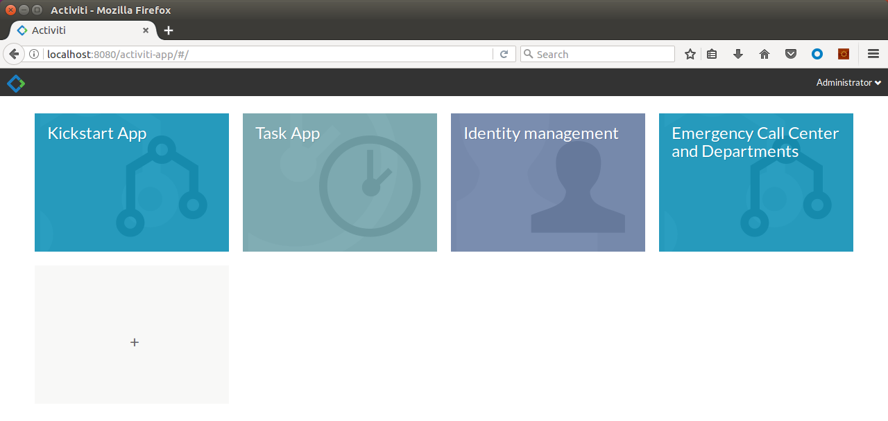

# Emergency Call Center (microservices)

The process implemented is related to an Emergency Call Center, coordinating the requests with different others Organizations (Fire Department, Police, Hospitals).
The idea is to be able to run the processes with a microservice architecture.
The goal is to define a very easy and initial process to demonstrate the power of Activiti and how it’s easy to manage (and possibly extend) the solution.
The process must work with the one Activiti installation only (not a “real” microservices architecture) because it must be easy to use and run with less possible dependencies.
The project works with Activiti version 6.0.

# Description of the process

Below a brief introduction of the implemented process.

## The entities

Below the entities involved in the process.

* Call Center. This entity manages the contacts from outside the Organizations and it is responsible to guarantee the issue is taken in charge. The Call Center works independently from the rest of the Organizations.

* Fire Department. This entity is responsible to take in charge the issues related to Fire and Emergency, with the proper resources and level of emergency. The Fire Department works independently from the rest of the Organizations.

* Police Department. This entity is responsible to take in charge the issues related to Public safety and Emergency, with the proper resources and level of emergency. The Police Department works independently from the rest of the Organizations.

* Hospital. This entity is responsible to take in charge the issues related to personal accidents, with the proper resources and level of emergency. In this example is supposed the hospital is one, but in general the solution could be easily scaled to managed different Public Entities with different specializations. The Hospital works independently from the rest of the Organizations.

## The actors

Below the actors involved in the process.

* The external actor. This could be a Citizen, a Policeman, a Employee of the Public Sector or everyone could have a problem and reaches the Call Center to raise an issue.

* The Employee of the Call Center. This is a known Employee of the Call Center using the software (and BPM) to manage the contacts and issues.

* The Employee of the Police Department. This is a known Employee of the Police Department using the software (and BPM) to manage the internal Policemen and resources of the Department.

* The Employee of the Hospital. This is a known Employee of the Hospital using the software (and BPM) to manage the internal Doctors and resources of the like Ambulances, etc.

## The lifecycle

The process to face starts with a contact from outside the organization where a Citizen, a Public Employee (a policeman for example) or an automatic software (using an authorized service over internet) contact the Call Center to raise an issue.

First of all, an internal Employee of the Call Center will take in charge the issue to collect some further details, with the goal to understand and check the issue. This check could naturally solve the issue (if possible) or continue with the involvement of the other Organizations.

According on what the Employee of the Call Center will collect as details, a Decision Table will automatically calculate the Organizations involved. From here, an inclusive gateway will define if the Fire Dept and/or the Police Dept and/or the Hospital will be involved.

Each Organization has a similar process to deal with. To request the right resources to the Organization, an automatic process will be called from the Call Center’s process. Once done, the Call Center will wait for a feedback.

In each Organization, an internal Employee will take in charge the issue with the goal to understand and evaluate the right resources for the issue. This check will confirm the solution (for example a burning stuff is compliance with the Firemen available in that moment), define the resources to use in this case (for example a complete team of Firemen with a truck) and send back an automatic feedback to the Call Center (connected to the right issue, not in general).

The Call Center will receive the feedback with a collection of details describing the solution (or denial) from the various Organizations and gives back a feedback to the external stakeholder. In case of denial, the Call Center will face the issue with another suggested solution (and this will cause an iteration in the process).

## The diagrams

Below the BPNM 2.0 diagrams of the four processes included.

### The Emergency Call Center

TODO

### The Fire Dept, Police Dept, Hospital

TODO

# Prerequisites

Before running the application, please check the assumptions listed below.

- Activiti 6.0 released on tomcat, running on `localhost` on port `8080`.

- MySql Ver 14.14 Distrib 5.7.19, for Linux (x86_64) using EditLine wrapper.

- Java version "1.8.0_131".

# Building the process

TODO

# Installing and running the process

TODO

# Screenshots

TODO

Below some screenshots of the application as an example.

# Feedback, issues or support

If something doesn't work for you, you'd probably need support.
This is not the right place to ask (and receive) support because exists a better place for it:

Feel free to ask there.

# Disclaimer

All the content available in this tutorial has been developed and tested using Activiti 6.0 release, Java 8 on a Linux Ubuntu 16.04.01 LTS as Operating System.
Each variation to the listed versions and tools could affect the success of the execution, even if the involved technologies and tasks have been defined to be as more general as possible, not related to any specific context or platform.

# License

Copyright (C) 2017 Alfresco Software Limited

Alfresco Software Limited licenses this file to you under the Apache License, Version 2.0 (the "License"); you may not use this file except in compliance with the License. You may obtain a copy of the License at

 http://www.apache.org/licenses/LICENSE-2.0

Unless required by applicable law or agreed to in writing, software distributed under the License is distributed on an "AS IS" BASIS, WITHOUT WARRANTIES OR CONDITIONS OF ANY KIND, either express or implied. See the License for the specific language governing permissions and limitations under the License.
