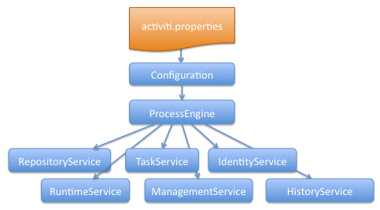
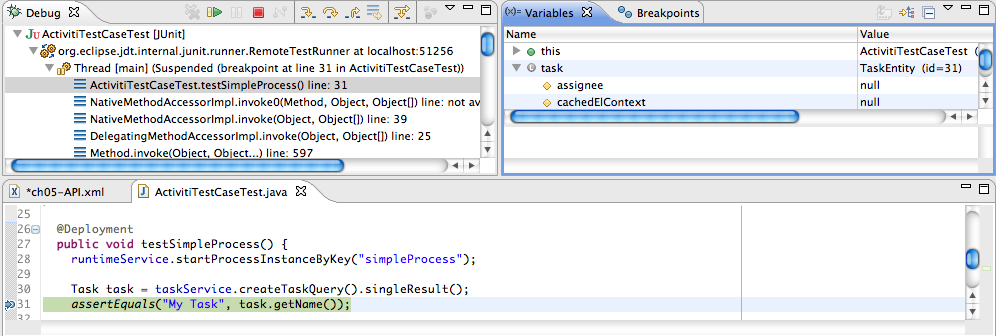
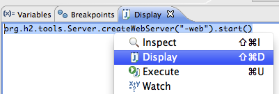
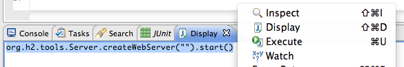
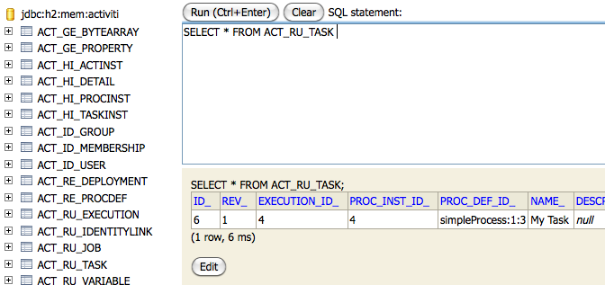

[[chapterApi]]

== The Activiti API

[[apiEngine]]

=== The Process Engine API and services

The engine API is the most common way of interacting with Activiti. The central starting point is the +ProcessEngine+, which can be created in several ways as described in the  <<configuration,configuration section>>. From the ProcessEngine, you can obtain the various services that contain the workflow/BPM methods.  ProcessEngine and the services objects are thread safe. So you can keep a reference to 1 of those for a whole server.

[source,java,linenums]
----
ProcessEngine processEngine = ProcessEngines.getDefaultProcessEngine();

RuntimeService runtimeService = processEngine.getRuntimeService();
RepositoryService repositoryService = processEngine.getRepositoryService();
TaskService taskService = processEngine.getTaskService();
ManagementService managementService = processEngine.getManagementService();
IdentityService identityService = processEngine.getIdentityService();
HistoryService historyService = processEngine.getHistoryService();
FormService formService = processEngine.getFormService();
----

+ProcessEngines.getDefaultProcessEngine()+ will initialize and build a process engine the first time it is called and afterwards always return the same process engine. Proper creation and closing of all process engines can be done with +ProcessEngines.init()+  and +ProcessEngines.destroy()+.

The ProcessEngines class will scan for all +activiti.cfg.xml+ and +activiti-context.xml+ files. For all +activiti.cfg.xml+ files, the process engine will be built in the typical Activiti way: +ProcessEngineConfiguration.createProcessEngineConfigurationFromInputStream(inputStream).buildProcessEngine()+. For all +activiti-context.xml+ files, the process engine will be built in the Spring way: First the Spring application context is created and then the process engine is obtained from that application context.

All services are stateless. This means that you can easily run Activiti on multiple nodes in a cluster, each going to the same database, without having to worry about which machine actually executed previous calls. Any call to any service is idempotent regardless of where it is executed.

The *RepositoryService* is probably the first service needed when working with the Activiti engine. This service offers operations for managing and manipulating +deployments+ and +process definitions+. Without going into much detail here, a process definition is a Java counterpart of BPMN 2.0 process. It is a representation of the structure and behaviour of each of the steps of a process. A +deployment+ is the unit of packaging within the Activiti engine. A deployment can contain multiple BPMN 2.0 xml files and any other resource. The choice of what is included in one deployment is up to the developer. It can range from a single process BPMN 2.0 xml file to a whole package of processes and relevant resources (for example the deployment 'hr-processes' could contain everything related to hr processes). The +RepositoryService+ allows to +deploy+ such packages. Deploying a deployment means it is uploaded to the engine, where all processes are inspected and parsed before being stored in the database. From that point on, the deployment is known to the system and any process included in the deployment can now be started.

Furthermore, this service allows to

* Query on deployments and process definitions known to the engine.
* Suspend and activate deployments as a whole or specific process definitions. Suspending means no further operations can be done on them, while activation is the opposite operation.
* Retrieve various resources such as files contained within the deployment or process diagrams that were auto generated by the engine.
* Retrieve a POJO version of the process definition which can be used to introspect the process using Java rather than xml.

While the +RepositoryService+ is rather about static information (i.e. data that doesn't change, or at least not a lot), the *RuntimeService* is quite the opposite. It deals with starting new process instances of process definitions. As said above, a +process definition+ defines the structure and behaviour of the different steps in a process. A process instance is one execution of such a process definition. For each process definition there typically are many instances running at the same time. The +RuntimeService+ also is the service which is used to retrieve and store +process variables+. This is data which is specific to the given process instance and can be used by various constructs in the process (e.g. an exclusive gateway often uses process variables to determine which path is chosen to continue the process). The +Runtimeservice+ also allows to query on process instances and executions. Executions are a representation of the +$$'token'$$+ concept of BPMN 2.0. Basically an execution is a pointer pointing to where the process instance currently is. Lastly, the +RuntimeService+ is used whenever a process instance is waiting for an external trigger and the process needs to be continued. A process instance can have various +wait states+ and this service contains various operations to 'signal' the instance that the external trigger is received and the process instance can be continued.

Tasks that need to be performed by actual human users of the system are core to a BPM engine such as Activiti. Everything around tasks is grouped in the *TaskService*, such as

* Querying tasks assigned to users or groups
* Creating new _standalone_ tasks. These are tasks that are not related to a process instances.
* Manipulating to which user a task is assigned or which users are in some way involved with the task.
* Claiming and completing a task. Claiming means that someone decided to be the assignee for the task, meaning that this user will complete the task. Completing means 'doing the work of the tasks'. Typically this is filling in a form of sorts.

The *IdentityService* is pretty simple. It allows the management (creation, update, deletion, querying, ...) of groups and users. It is important to understand that Activiti actually doesn't do any checking on users at runtime. For example, a task could be assigned to any user, but the engine does not verify if that user is known to the system. This is because the Activiti engine can also be used in conjunction with services such as LDAP, Active Directory, etc.

The *FormService* is an optional service. Meaning that Activiti can perfectly be used without it, without sacrificing any functionality. This service introduces the concept of a _start form_ and a _task form_. A _start form_ is a form that is shown to the user before the process instance is started, while a _task form_ is the form that is displayed when a user wants to complete a form. Activiti allows to define these forms in the BPMN 2.0 process definition. This service exposes this data in an easy way to work with. But again, this is optional as forms don't need to be embedded in the process definition.

The *HistoryService* exposes all historical data gathered by the Activiti engine. When executing processes, a lot of data can be kept by the engine (this is configurable) such as process instance start times, who did which tasks, how long it took to complete the tasks, which path was followed in each process instance, etc. This service exposes mainly query  capabilities to access this data.

The *ManagementService* is typically not needed when coding custom application using Activiti. It allows to retrieve information about the database tables and table metadata. Furthermore, it exposes query capabilities and management operations for jobs. Jobs are used in Activiti for various things such as timers, asynchronous continuations, delayed suspension/activation, etc. Later on, these topics will be discussed in more detail.

For more detailed information on the service operations and the engine API, see link:$$http://activiti.org/javadocs/index.html$$[the javadocs].

=== Exception strategy

The base exception in Activiti is the +org.activiti.engine.ActivitiException+, an unchecked exception. This exception can be thrown at all times by the API, but 'expected' exceptions that happen in specific methods are documented in the link:$$http://activiti.org/javadocs/index.html$$[ the javadocs]. For example, an extract from ++TaskService++:

[source,java,linenums]
----
/**
 * Called when the task is successfully executed.
 * @param taskId the id of the task to complete, cannot be null.
 * @throws ActivitiObjectNotFoundException when no task exists with the given id.
 */
 void complete(String taskId);
----

In the example above, when an id is passed for which no task exists, an exception will be thrown. Also, since the javadoc *explicitly states that taskId cannot be null, an +ActivitiIllegalArgumentException+ will be thrown when +null+ is passed*.

Even though we want to avoid a big exception hierarchy, the following subclasses were added which are thrown in specific cases. All other errors that occur during process-execution or API-invocation that don't fit into the possible exceptions below, are thrown as regular ++ActivitiExceptions++s.

* ++ActivitiWrongDbException++: Thrown when the Activiti engine discovers a mismatch between the database schema version and the engine version.
* ++ActivitiOptimisticLockingException++: Thrown when an optimistic locking occurs in the data store caused by concurrent access of the same data entry.
* ++ActivitiClassLoadingException++: Thrown when a class requested to load was not found or when an error occurred while loading it (e.g. JavaDelegates, TaskListeners, ...).
* ++ActivitiObjectNotFoundException++: Thrown when an object that is requested or action on does not exist.
* ++ActivitiIllegalArgumentException++: An exception indicating that an illegal argument has been supplied in an Activiti API-call, an illegal value was configured in the engine's configuration or an illegal value has been supplied or an illegal value is used in a process-definition.
* ++ActivitiTaskAlreadyClaimedException++: Thrown when a task is already claimed, when the +taskService.claim(...)+ is called.

[[api.services]]

=== Working with the Activiti services

As described above, the way to interact with the Activiti engine is through the services exposed by an instance of the +org.activiti.engine.ProcessEngine+ class. The following code snippets assume you have a working Activiti environment, i.e. you have access to a valid +org.activiti.engine.ProcessEngine+. If you simply want to try out the code below, you can download or clone the link:$$https://github.com/Activiti/activiti-unit-test-template$$[Activiti unit test template], import it in your IDE and add a +testUserguideCode()+ method to the +org.activiti.MyUnitTest+ unit test.

The end goal of this little tutorial will be to have a working business process which mimics a simplistic vacation request process at a company:

image::images/api.vacationRequest.png[align="center"]

[[api.services.deployment]]

==== Deploying the process

Everything that is related to 'static' data (such as process definitions) are accessed through the *RepositoryService*. Conceptually, every such static piece of data is content of the 'repository' of the Activiti engine.

Create a new xml file +VacationRequest.bpmn20.xml+ in the +src/test/resources/org/activiti/test+ resource folder (or anywhere else if you're not using the unit test template) with the following content. Note that this section won't explain the xml constructs being used in the example above. Please read <<bpmn20,the BPMN 2.0 chapter>> to become familiar with these constructs first if needed.

[source,xml,linenums]
----
<?xml version="1.0" encoding="UTF-8" ?>
<definitions id="definitions"
             targetNamespace="http://activiti.org/bpmn20"
             xmlns="http://www.omg.org/spec/BPMN/20100524/MODEL"
             xmlns:xsi="http://www.w3.org/2001/XMLSchema-instance"
             xmlns:activiti="http://activiti.org/bpmn">

  <process id="vacationRequest" name="Vacation request">

    <startEvent id="request" activiti:initiator="employeeName">
      <extensionElements>
        <activiti:formProperty id="numberOfDays" name="Number of days" type="long" value="1" required="true"/>
        <activiti:formProperty id="startDate" name="First day of holiday (dd-MM-yyy)" datePattern="dd-MM-yyyy hh:mm" type="date" required="true" />
        <activiti:formProperty id="vacationMotivation" name="Motivation" type="string" />
      </extensionElements>
    </startEvent>
    <sequenceFlow id="flow1" sourceRef="request" targetRef="handleRequest" />

    <userTask id="handleRequest" name="Handle vacation request" >
      <documentation>
        ${employeeName} would like to take ${numberOfDays} day(s) of vacation (Motivation: ${vacationMotivation}).
      </documentation>
      <extensionElements>
         <activiti:formProperty id="vacationApproved" name="Do you approve this vacation" type="enum" required="true">
          <activiti:value id="true" name="Approve" />
          <activiti:value id="false" name="Reject" />
        </activiti:formProperty>
        <activiti:formProperty id="managerMotivation" name="Motivation" type="string" />
      </extensionElements>
      <potentialOwner>
        <resourceAssignmentExpression>
          <formalExpression>management</formalExpression>
        </resourceAssignmentExpression>
      </potentialOwner>
    </userTask>
    <sequenceFlow id="flow2" sourceRef="handleRequest" targetRef="requestApprovedDecision" />

    <exclusiveGateway id="requestApprovedDecision" name="Request approved?" />
    <sequenceFlow id="flow3" sourceRef="requestApprovedDecision" targetRef="sendApprovalMail">
      <conditionExpression xsi:type="tFormalExpression">${vacationApproved == 'true'}</conditionExpression>
    </sequenceFlow>

    <task id="sendApprovalMail" name="Send confirmation e-mail" />
    <sequenceFlow id="flow4" sourceRef="sendApprovalMail" targetRef="theEnd1" />
    <endEvent id="theEnd1" />

    <sequenceFlow id="flow5" sourceRef="requestApprovedDecision" targetRef="adjustVacationRequestTask">
      <conditionExpression xsi:type="tFormalExpression">${vacationApproved == 'false'}</conditionExpression>
    </sequenceFlow>

    <userTask id="adjustVacationRequestTask" name="Adjust vacation request">
      <documentation>
        Your manager has disapproved your vacation request for ${numberOfDays} days.
        Reason: ${managerMotivation}
      </documentation>
      <extensionElements>
        <activiti:formProperty id="numberOfDays" name="Number of days" value="${numberOfDays}" type="long" required="true"/>
        <activiti:formProperty id="startDate" name="First day of holiday (dd-MM-yyy)" value="${startDate}" datePattern="dd-MM-yyyy hh:mm" type="date" required="true" />
        <activiti:formProperty id="vacationMotivation" name="Motivation" value="${vacationMotivation}" type="string" />
        <activiti:formProperty id="resendRequest" name="Resend vacation request to manager?" type="enum" required="true">
          <activiti:value id="true" name="Yes" />
          <activiti:value id="false" name="No" />
        </activiti:formProperty>
      </extensionElements>
      <humanPerformer>
        <resourceAssignmentExpression>
          <formalExpression>${employeeName}</formalExpression>
        </resourceAssignmentExpression>
      </humanPerformer>
    </userTask>
    <sequenceFlow id="flow6" sourceRef="adjustVacationRequestTask" targetRef="resendRequestDecision" />

    <exclusiveGateway id="resendRequestDecision" name="Resend request?" />
    <sequenceFlow id="flow7" sourceRef="resendRequestDecision" targetRef="handleRequest">
      <conditionExpression xsi:type="tFormalExpression">${resendRequest == 'true'}</conditionExpression>
    </sequenceFlow>

     <sequenceFlow id="flow8" sourceRef="resendRequestDecision" targetRef="theEnd2">
      <conditionExpression xsi:type="tFormalExpression">${resendRequest == 'false'}</conditionExpression>
    </sequenceFlow>
    <endEvent id="theEnd2" />

  </process>

</definitions>
----

To make this process known to the Activiti engine, we must 'deploy' it first. Deploying means that the engine will parse the BPMN 2.0 xml to something executable and a new database record will be added for each process definition included in the 'deployment'. This way, when the engine reboots, it will still know all of the 'deployed' processes:

[source,java,linenums]
----
ProcessEngine processEngine = ProcessEngines.getDefaultProcessEngine();
RepositoryService repositoryService = processEngine.getRepositoryService();
repositoryService.createDeployment()
  .addClasspathResource("org/activiti/test/VacationRequest.bpmn20.xml")
  .deploy();

Log.info("Number of process definitions: " + repositoryService.createProcessDefinitionQuery().count());
----

Read more about deployment in the <<chDeployment,deployment chapter>>.

[[api.services.start.processinstance]]

==== Starting a process instance

After deploying the process definition to the Activiti engine, we can start new process instances from it. For each process definition, there are typically many process instances. The process definition is the 'blueprint', while a process instance is a runtime execution of it.

Everything related to the runtime state of processes can be found in the *RuntimeService*. There are various way to start a new process instance. In the following snippet, we use the key we defined in the process definition xml to start the process instance. We're also providing some process variables at process instance start, because the description of the first user task will use these in its expressions. Process variables are commonly used because they give meaning to the process instances for a certain process definition. Typically, the process variables are what make process instances differ from one another.

[source,java,linenums]
----
Map<String, Object> variables = new HashMap<String, Object>();
variables.put("employeeName", "Kermit");
variables.put("numberOfDays", new Integer(4));
variables.put("vacationMotivation", "I'm really tired!");

RuntimeService runtimeService = processEngine.getRuntimeService();
ProcessInstance processInstance = runtimeService.startProcessInstanceByKey("vacationRequest", variables);

// Verify that we started a new process instance
Log.info("Number of process instances: " + runtimeService.createProcessInstanceQuery().count());

----

[[api.services.tasks]]

==== Completing tasks

When the process starts, the first step will be a user task. This is a step that must be performed by a user of the system. Typically, such a user will have an 'inbox of tasks' which lists all the tasks that need to be done by this user. Following code snippet shows how such a query might be performed:

[source,java,linenums]
----
// Fetch all tasks for the management group
TaskService taskService = processEngine.getTaskService();
List<Task> tasks = taskService.createTaskQuery().taskCandidateGroup("management").list();
for (Task task : tasks) {
  Log.info("Task available: " + task.getName());
}
----

To continue the process instance, we need to finish this task. For the Activiti engine, this means you need to +complete+ the task. Following snippet shows how this is done:

[source,java,linenums]
----
Task task = tasks.get(0);

Map<String, Object> taskVariables = new HashMap<String, Object>();
taskVariables.put("vacationApproved", "false");
taskVariables.put("managerMotivation", "We have a tight deadline!");
taskService.complete(task.getId(), taskVariables);
----

The process instance will now continue to the next step. In this example, the next step allows the employee to complete a form that adjusts their original vacation request. The employee can resubmit the vacation request which will cause the process to loop back to the start task.

[[api.services.suspend]]

==== Suspending and activating a process

It's possible to suspend a process definition. When a process definition is suspended, new process instance can't be created (an exception will be thrown). Suspending the process definition is done through the ++RepositoryService++:

[source,java,linenums]
----
repositoryService.suspendProcessDefinitionByKey("vacationRequest");
try {
  runtimeService.startProcessInstanceByKey("vacationRequest");
} catch (ActivitiException e) {
  e.printStackTrace();
}
----

To reactivate a process definition, simply call one of the +repositoryService.activateProcessDefinitionXXX+ methods.

It's also possible to suspend a process instance. When suspended, the process cannot
 be continued (e.g. completing a task throws an exception) and no jobs (such as timers) will executed. Suspending a process instance can be done by calling the +runtimeService.suspendProcessInstance+ method. Activating the process instance again is done by calling the +runtimeService.activateProcessInstanceXXX+ methods.

[[api.services]]

==== Further reading

We've barely scratched the surface in the previous sections regarding Activiti functionality. We will expand these sections further in the future with additional coverage of the Activiti API. Of course, as with any open source project, the best way to learn is to inspect the code and read the Javadocs!

[[queryAPI]]

=== Query API

There are two ways of querying data from the engine: The query API and native queries. The Query API allows to program completely typesafe queries with a fluent API. You can add various conditions to your queries (all of which are applied together as a logical AND) and precisely one ordering. The following code shows an example:

[source,java,linenums]
----
List<Task> tasks = taskService.createTaskQuery()
    .taskAssignee("kermit")
    .processVariableValueEquals("orderId", "0815")
    .orderByDueDate().asc()
    .list();
----

Sometimes you need more powerful queries, e.g. queries using an OR operator or restrictions you cannot express using the Query API. For these cases, we introduced native queries, which allow you to write your own SQL queries. The return type is defined by the Query object you use and the data is mapped into the correct objects, e.g. Task, ProcessInstance, Execution, etc.... Since the query will be fired at the database you have to use table and column names as they are defined in the database; this requires some knowledge about the internal data structure and it is recommended to use native queries with care. The table names can be retrieved via the API to keep the dependency as small as possible.

[source,java,linenums]
----
List<Task> tasks = taskService.createNativeTaskQuery()
  .sql("SELECT count(*) FROM " + managementService.getTableName(Task.class) + " T WHERE T.NAME_ = #{taskName}")
  .parameter("taskName", "gonzoTask")
  .list();

long count = taskService.createNativeTaskQuery()
  .sql("SELECT count(*) FROM " + managementService.getTableName(Task.class) + " T1, "
    + managementService.getTableName(VariableInstanceEntity.class) + " V1 WHERE V1.TASK_ID_ = T1.ID_")
  .count();
----

[[apiVariables]]

=== Variables

Every process instance needs and uses data to execute the steps it exists of. In Activiti, this data is called _variables_, which are stored in the database. Variables can be used in expressions (for example to select the correct outgoing sequence flow in an exclusive gateway), in java service tasks when calling external services (for example to provide the input or store the result of the service call), etc.

A process instance can have variables (called _process variables_), but also _executions_ (which are specific pointers to where the process is active) and user tasks can have variables. A process instance can have any number of variables. Each variable is stored in a row in the _ACT_RU_VARIABLE_ database table.

Any of the _startProcessInstanceXXX_ methods have an optional parameters to provide the variables when the process instance is created and started. For example, from the _RuntimeService_:

[source,java,linenums]
----
ProcessInstance startProcessInstanceByKey(String processDefinitionKey, Map<String, Object> variables);
----

Variables can be added during process execution. For example (_RuntimeService_):

[source,java,linenums]
----
void setVariable(String executionId, String variableName, Object value);
void setVariableLocal(String executionId, String variableName, Object value);
void setVariables(String executionId, Map<String, ? extends Object> variables);
void setVariablesLocal(String executionId, Map<String, ? extends Object> variables);
----

Note that variables can be set _local_ for a given execution (remember a process instance consists of a tree of executions). The variable will only be visible on that execution, and not higher in the tree of executions. This can be useful if data shouldn't be propagated to the process instance level, or the variable has a new value for a certain path in the process instance (for example when using parallel paths).

Variables can also be fetched again, as shown below. Note that similar methods exist on the _TaskService_. This means that tasks, like executions, can have local variables that are 'alive' just for the duration of the task.

[source,java,linenums]
----
Map<String, Object> getVariables(String executionId);
Map<String, Object> getVariablesLocal(String executionId);
Map<String, Object> getVariables(String executionId, Collection<String> variableNames);
Map<String, Object> getVariablesLocal(String executionId, Collection<String> variableNames);
Object getVariable(String executionId, String variableName);
<T> T getVariable(String executionId, String variableName, Class<T> variableClass);
----

Variables are often used in <<bpmnJavaServiceTask, Java delegates>>, <<apiExpressions, expressions>>, execution- or tasklisteners, scripts, etc. In those constructs, the current _execution_ or _task_ object is available and it can be used for variable setting and/or retrieval. The simplest methods are these:

[source,java,linenums]
----
execution.getVariables();
execution.getVariables(Collection<String> variableNames);
execution.getVariable(String variableName);

execution.setVariables(Map<String, object> variables);
execution.setVariable(String variableName, Object value);
----

Note that a variant with _local_ is also available for all of the above.

For historical (and backwards compatible reasons), when doing any of the calls above, behind the scenes actually *all* variables will be fetched from the database. This means that if you have 10 variables, and only get one through _getVariable("myVariable")_, behind the scenes the other 9 will be fetched and cached. This is not bad, as subsequent calls will not hit the database again.  For example, when your process definition has three sequential service tasks (and thus one database transaction), using one call to fetch all variables in the first service task might be better then fetching the variables needed in each service task separately. Note that this applies *both* for getting and setting variables.

Of course, when using a lot of variables or simply when you want tight control on the database query and traffic, this is not appropriate. Since Activiti 5.17, new methods have been introduced to give a tighter control on this, by adding in new methods that have an optional parameter that tells the engine whether or not behind the scenes all variables need to be fetched and cached:

[source,java,linenums]
----
Map<String, Object> getVariables(Collection<String> variableNames, boolean fetchAllVariables);
Object getVariable(String variableName, boolean fetchAllVariables);
void setVariable(String variableName, Object value, boolean fetchAllVariables);
----

When using _true_ for the parameter _fetchAllVariables_, the behaviour will be exactly as described above: when getting or setting a variable, all other variables will be fetched and cached.

However, when using _false_ as value, a specific query will be used and no other variables will be fetched nor cached. Only the value of the variable in question here will be cached for subsequent use.

[[apiExpressions]]

=== Expressions

Activiti uses UEL for expression-resolving. UEL stands for _Unified Expression Language_ and is part of the EE6 specification (see link:$$http://docs.oracle.com/javaee/6/tutorial/doc/gjddd.html$$[ the EE6 specification] for detailed information). To support all features of latest UEL spec on ALL environments, we use a modified version of JUEL.

Expressions can be used in for example <<bpmnJavaServiceTaskXML,Java Service tasks>>, <<executionListeners,Execution Listeners>>, <<taskListeners,Task Listeners>> and <<conditionalSequenceFlowXml,Conditional sequence flows>>. Although there are 2 types of expressions, value-expression and method-expression, Activiti abstracts  this so they can both be used where an +expression+ is needed.

* *Value expression*: resolves to a value. By default, all process variables are available to use. Also all spring-beans (if using Spring) are available to use in expressions. Some examples:

----
${myVar}
${myBean.myProperty}
----

* *Method expression*: invokes a method, with or without parameters. *When invoking a method without parameters, be sure to add empty parentheses after the method-name (as this distinguishes the expression from a value expression).* The passed parameters can be literal values or expressions that are resolved themselves. Examples:

----
${printer.print()}
${myBean.addNewOrder('orderName')}
${myBean.doSomething(myVar, execution)}
----

Note that these expressions support resolving primitives (incl. comparing them), beans, lists, arrays and maps.

On top of all process variables, there are a few default objects available to be used in expressions:

* ++execution++: The +DelegateExecution+ that holds additional information about the ongoing execution.
* ++task++: The +DelegateTask+ that holds additional information about the current Task. *Note: Only works in expressions evaluated from task listeners.*
* ++authenticatedUserId++: The id of the user that is currently authenticated. If no user is authenticated, the variable is not available.

For more concrete usage and examples, check out <<springExpressions,Expressions in Spring>>, <<bpmnJavaServiceTaskXML,Java Service tasks>>, <<executionListeners,Execution Listeners>>,  <<taskListeners,Task Listeners>> or <<conditionalSequenceFlowXml,Conditional sequence flows>>.

[[apiUnitTesting]]

=== Unit testing

Business processes are an integral part of software projects and they should be tested in the same way normal application logic is tested: with unit tests. Since Activiti is an embeddable Java engine, writing unit tests for business processes is as simple as writing regular unit tests.

Activiti supports both JUnit versions 3 and 4 styles of unit testing. In the JUnit 3 style, the +org.activiti.engine.test.ActivitiTestCase+ must be extended. This will make the ProcessEngine and the services available through protected member fields. In the +setup()+ of the test,  the processEngine will be initialized by default with the +activiti.cfg.xml+ resource on the classpath.  To specify a different configuration file, override the _getConfigurationResource()_ method. Process engines are cached statically over multiple unit tests when the configuration resource is the same.

By extending +ActivitiTestCase+, you can annotate test methods with +org.activiti.engine.test.Deployment+. Before the test is run, a resource file of the form +testClassName.testMethod.bpmn20.xml+ in the same package as the test class, will be deployed. At the end of the test, the deployment will be deleted, including all related process instances, tasks, etc. The +Deployment+ annotation also supports setting the resource location explicitly. See the class itself for more information.

Taking all that in account, a JUnit 3 style test looks as follows.

[source,java,linenums]
----
public class MyBusinessProcessTest extends ActivitiTestCase {

  @Deployment
  public void testSimpleProcess() {
    runtimeService.startProcessInstanceByKey("simpleProcess");

    Task task = taskService.createTaskQuery().singleResult();
    assertEquals("My Task", task.getName());

    taskService.complete(task.getId());
    assertEquals(0, runtimeService.createProcessInstanceQuery().count());
  }
}
----

To get the same functionality when using the JUnit 4 style of writing unit tests, the +org.activiti.engine.test.ActivitiRule+ Rule must be used. Through this rule, the process engine and services are available through getters. As with the +ActivitiTestCase+ (see above), including this +Rule+ will enable the use of the +org.activiti.engine.test.Deployment+ annotation (see above for an explanation of its use and configuration) and it will look for the default configuration file on the classpath. Process engines are statically cached over multiple unit tests when using the same configuration resource.

The following code snippet shows an example of using the JUnit 4 style of testing and the usage of the +ActivitiRule+.

[source,java,linenums]
----
public class MyBusinessProcessTest {

  @Rule
  public ActivitiRule activitiRule = new ActivitiRule();

  @Test
  @Deployment
  public void ruleUsageExample() {
    RuntimeService runtimeService = activitiRule.getRuntimeService();
    runtimeService.startProcessInstanceByKey("ruleUsage");

    TaskService taskService = activitiRule.getTaskService();
    Task task = taskService.createTaskQuery().singleResult();
    assertEquals("My Task", task.getName());

    taskService.complete(task.getId());
    assertEquals(0, runtimeService.createProcessInstanceQuery().count());
  }
}
----

[[apiDebuggingUnitTest]]

=== Debugging unit tests

When using the in-memory H2 database for unit tests, the following instructions allow to easily inspect the data in the Activiti database during a debugging session. The screenshots here are taken in Eclipse, but the mechanism should be similar for other IDEs.

Suppose we have put a _breakpoint_ somewhere in our unit test. In Eclipse this is done by double-clicking in the left border next to the code:

image::images/api.test.debug.breakpoint.png[align="center"]

If we now run the unit test in _debug_ mode (right-click in test class, select 'Run as' and then 'JUnit test'), the test execution halts at our breakpoint, where we can now inspect the variables of our test as shown in the right upper panel.

To inspect the Activiti data, open up the _'Display'_ window (if this window isn't there, open Window->Show View->Other and select _Display_.) and type (code completion is available) +org.h2.tools.Server.createWebServer("-web").start()+

Select the line you've just typed and right-click on it. Now select 'Display' (or execute the shortcut instead of right-clicking)

Now open up a browser and go to link:$$http://localhost:8082$$[http://localhost:8082], and fill in the JDBC URL to the in-memory database (by default this is ++jdbc:h2:mem:activiti++), and hit the connect button.

image::images/api.test.debug.h2.login.png[align="center"]

You can now see the Activiti data and use it to understand how and why your unit test is executing your process in a certain way.

[[apiProcessEngineInWebApp]]

=== The process engine in a web application

The +ProcessEngine+ is a thread-safe class and can easily be shared among multiple threads. In a web application, this means it is possible to create the process engine once when the container boots and shut down the engine when the container goes down.

The following code snippet shows how you can write a simple +ServletContextListener+ to initialize and destroy process engines in a plain Servlet environment:

[source,java,linenums]
----
public class ProcessEnginesServletContextListener implements ServletContextListener {

  public void contextInitialized(ServletContextEvent servletContextEvent) {
    ProcessEngines.init();
  }

  public void contextDestroyed(ServletContextEvent servletContextEvent) {
    ProcessEngines.destroy();
  }

}
----

The +contextInitialized+ method will delegate to +ProcessEngines.init()+. That will look for +activiti.cfg.xml+ resource files on the classpath, and create a +ProcessEngine+ for the given configurations (e.g. multiple jars with a configuration file). If you have multiple such resource files on the classpath, make sure they all have different names. When the process engine is needed, it can be fetched using

[source,java,linenums]
----
ProcessEngines.getDefaultProcessEngine()
----

or

[source,java,linenums]
----
ProcessEngines.getProcessEngine("myName");
----

Of course, it is also possible to use any of the variants of creating a process engine,
as described in the <<configuration,configuration section>>.

The +contextDestroyed+ method of the context-listener delegates to +ProcessEngines.destroy()+. That will properly close all initialized process engines.
