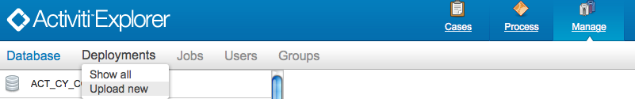
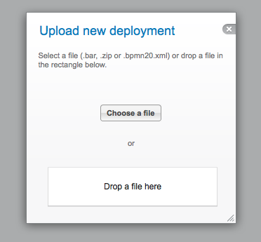
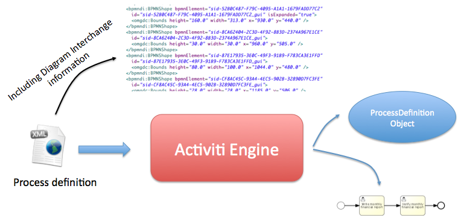

[[chDeployment]]

== Deployment

=== Business archives

To deploy processes, they have to be wrapped in a business archive.  A business archive is the unit of deployment to an Activiti Engine. A business archive is equivalent to a zip file.  It can contain  BPMN 2.0 processes, task forms, rules and any other type of file.  In general, a business archive contains a collection of named resources.

When a business archive is deployed, it is scanned for BPMN files with a +.bpmn20.xml+ or +.bpmn+ extension. Each of those will be parsed and may contain multiple process definitions.

[NOTE]
====
Java classes present in the business archive *will not be added to the classpath*. All custom classes used in process definitions in the business archive (for example Java service tasks or event listener implementations) should be present on the activiti-engine's classpath in order to run the processes.
====

==== Deploying programmatically

Deploying a business archive from a zip file can be done like this:

[source,java,linenums]
----
String barFileName = "path/to/process-one.bar";
ZipInputStream inputStream = new ZipInputStream(new FileInputStream(barFileName));

repositoryService.createDeployment()
    .name("process-one.bar")
    .addZipInputStream(inputStream)
    .deploy();

----

It's also possible to build a deployment from individual resources. See the javadocs for more details.

[[deploymentWithExplorer]]

==== Deploying with Activiti Explorer

The Activiti Explorer webapp allows uploading bar files (and single +bpmn20.xml+ files) through the webapp user interface. Choose the _Management tab_ and click on __Deployment__:

A popup window now allows you to select a file from your computer, or you can simply drag and drop
to the designated area (if your browser supports it).

=== External resources

Process definitions live in the Activiti database. These process definitions can reference delegation classes when using Service Tasks or execution listeners or Spring beans from the Activiti configuration file. These classes and the Spring configuration file have to be available to all process engines that may execute the process definitions.

==== Java classes

All custom classes that are used in your process (e.g. JavaDelegates used in Service Tasks or event-listeners, TaskListeners, ...) should be present on the engine's classpath when an instance of the process is started.

During deployment of a business archive however, those classes don't have to be present on the classpath. This means that your delegation classes don't have to be on the classpath when deploying a new business archive with Ant.

When you are using the demo setup and you want to add your custom classes, you should add a jar containing your classes to the activiti-explorer or activiti-rest webapp lib. Don't forget to include the dependencies of your custom classes (if any) as well. Alternatively, you can include your dependencies in the libraries directory of your Tomcat installation, +${tomcat.home}/lib+.

==== Using Spring beans from a process

When expressions or scripts use Spring beans, those beans have to be available to the engine when executing the process definition. If you are building your own webapp and you configure your process engine in your context as described in <<springintegration,the spring integration section>>, that is straightforward. But bear in mind that you also should update the Activiti rest webapp with that context if you use it. You can do that by replacing the +activiti.cfg.xml+ in the +activiti-rest/lib/activiti-cfg.jar+ JAR file with an +activiti-context.xml+ file containing your Spring context configuration.

==== Creating a single app

Instead of making sure that all process engines have all the delegation classes on their classpath and use the right Spring configuration, you may consider including the Activiti rest webapp inside your own webapp so that there is only a single +ProcessEngine+.

[[versioningOfProcessDefinitions]]

=== Versioning of process definitions

BPMN doesn't have a notion of versioning.  That is actually good because the executable BPMN process file will probably live in a version control system repository (e.g. Subversion, Git or Mercurial) as part of your development project.  Versions of process definitions are created during deployment. During deployment, Activiti will assign a version to the +ProcessDefinition+ before it is stored in the Activiti DB.

For each process definition in a business archive the following steps are performed to initialize the properties +key+, +version+, +name+ and ++id++:

* The process definition +id+ attribute in the XML file is used as the process definition +key+ property.
* The process definition +name+ attribute in the XML file is used as the process definition +name+ property. If the name attribute is not specified, then id attribute is used as the name.
* The first time a process with a particular key is deployed, version 1 is assigned.  For all subsequent deployments of process definitions with the same key, the version will be set 1 higher than the maximum currently deployed version. The key property is used to distinguish process definitions.
* The id property is set to {processDefinitionKey}:{processDefinitionVersion}:{generated-id}, where +generated-id+ is a unique number added to guarantee uniqueness of the process id for the process definition caches in a clustered environment.

Take for example the following process

[source,xml,linenums]
----
<definitions id="myDefinitions" >
  <process id="myProcess" name="My important process" >
    ...
----

When deploying this process definition, the process definition in the database will look like this:

[options="header"]
|===============
|id|key|name|version
|myProcess:1:676|myProcess|My important process|1

|===============

Suppose we now deploy an updated version of the same process (e.g. changing some user tasks), but the ++id++ of the process definition remains the same. The process definition table will now contain the following entries:

[options="header"]
|===============
|id|key|name|version
|myProcess:1:676|myProcess|My important process|1
|myProcess:2:870|myProcess|My important process|2

|===============

When the ++runtimeService.startProcessInstanceByKey("myProcess")++ is called, it will now use the process definition with version ++2++, as this is the latest version of the process definition.

Should we create a second process, as defined below and deploy this to Activiti, a third row will be added to the table.

[source,xml,linenums]
----
<definitions id="myNewDefinitions" >
  <process id="myNewProcess" name="My important process" >
    ...
----

The table will look like this:

[options="header"]
|===============
|id|key|name|version
|myProcess:1:676|myProcess|My important process|1
|myProcess:2:870|myProcess|My important process|2
|myNewProcess:1:1033|myNewProcess|My important process|1

|===============

Note how the key for the new process is different from our first process. Even though the name is the same (we should probably have changed that too), Activiti only considers the +id+ attribute when distinguishing processes. The new process is therefore deployed with version 1.

[[providingProcessDiagram]]

=== Providing a process diagram

A process diagram image can be added to a deployment. This image will be stored in the Activiti repository and is accessible through the API. This image is also used to visualize the process in Activiti Explorer.

Suppose we have a process on our classpath, +org/activiti/expenseProcess.bpmn20.xml+ that has a process key 'expense'. The following naming conventions for the process diagram image apply (in this specific order):

* If an image resource exists in the deployment that has a name of the BPMN 2.0 XML file name concatenated with the process key and an image suffix, this image is used. In our example, this would be +org/activiti/expenseProcess.expense.png+ (or .jpg/gif). In case you have multiple images defined in one BPMN 2.0 XML file, this approach makes most sense. Each diagram image will then have the process key in its file name.
* If no such image exists, am image resource in the deployment matching the name of the BPMN 2.0 XML file is searched for. In our example this would be +org/activiti/expenseProcess.png+. Note that this means that *every process definition* defined in the same BPMN 2.0 file has the same process diagram image. In case there is only one process definition in each BPMN 2.0 XML file, this is obviously not a problem.

Example when deploying programmatically:

[source,java,linenums]
----

repositoryService.createDeployment()
  .name("expense-process.bar")
  .addClasspathResource("org/activiti/expenseProcess.bpmn20.xml")
  .addClasspathResource("org/activiti/expenseProcess.png")
  .deploy();
----

The image resource can be retrieved through the API afterwards:

[source,java,linenums]
----
ProcessDefinition processDefinition = repositoryService.createProcessDefinitionQuery()
  .processDefinitionKey("expense")
  .singleResult();

String diagramResourceName = processDefinition.getDiagramResourceName();
InputStream imageStream = repositoryService.getResourceAsStream(
    processDefinition.getDeploymentId(), diagramResourceName);
----

[[generatingProcessDiagram]]

=== Generating a process diagram

In case no image is provided in the deployment, as described in the <<providingProcessDiagram,previous section>>, the Activiti engine will generate a diagram image if the process definition contains the necessary 'diagram interchange' information.

The resource can be retrieved in exactly the same way as when <<providingProcessDiagram, an image is provided>> in the deployment.

If, for some reason, it is not necessary or wanted to generate a diagram during deployment the +isCreateDiagramOnDeploy+ property can be set on the process engine configuration:

[source,xml,linenums]
----
<property name="createDiagramOnDeploy" value="false" />
----

No diagram will be generated now.

[[deploymentCategory]]

=== Category

Both deployments and process definitions have user defined categories.  The process definition category is initialized value in attribute in the BPMN file: +<definitions ... targetNamespace="yourCategory" ...+

The deployment category can be specified in the API like this:

[source,java,linenums]
----
repositoryService
    .createDeployment()
    .category("yourCategory")
    ...
    .deploy();
----
