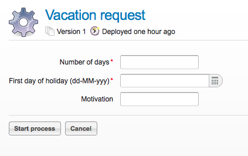

[[forms]]

== Forms

Activiti provides a convenient and flexible way to add forms for the manual steps of  your business processes.  We support two strategies to work with forms: Build-in form rendering with form properties and external form rendering.

[[formProperties]]

=== Form properties

All information relevant to a business process is either included in the process  variables themselves or referenced through the process variables.  Activiti supports complex Java objects to be stored as process variables like +Serializable+ objects, JPA entities or whole XML documents as ++String++s.

Starting a process and completing user tasks is where people are involved into a process. Communicating with people requires forms to be rendered in some UI technology.  In order to facilitate multiple UI technologies easy, the process definition can include the logic of transforming of the complex Java typed objects in the process variables to a +Map<String,String>+ of *'properties'*.

Any UI technology can then build a form on top of those properties, using the Activiti API methods that expose the property information. The properties can provide a dedicated (and more limited) view on the process variables. The properties needed to display a form are available in the *FormData* return values of for example

[source,java,linenums]
----
StartFormData FormService.getStartFormData(String processDefinitionId)
----

or

[source,java,linenums]
----
TaskFormdata FormService.getTaskFormData(String taskId)
----

By default, the build-in form engines, 'sees' the properties as well as the process variables.  So there is no need to declare task form properties if they match 1-1 with the process variables.  For example, with the following declaration:

[source,xml,linenums]
----
<startEvent id="start" />
----

All process variables are available when execution arrives in the startEvent, but

[source,java,linenums]
----
formService.getStartFormData(String processDefinitionId).getFormProperties()
----

will be empty since no specific mapping was defined.

In the above case, all the submitted properties will be stored as process variables. This means that by simply adding a new input field in the form, a new variable can be stored.

Properties are derived from process variables, but they don't have to be stored as process variables.  For example, a process variable could be a JPA entity of class Address.  And a form property +StreetName+ used by the UI technology could be linked with an expression +#{address.street}+

Analogue, the properties that a user is supposed to submit in a form can be stored as a process variable or as a nested property in one of the process variables with a UEL value expression like e.g. +#{address.street}+ .

Analogue the default behavior of properties that are submitted is that they will be stored as process variables unless a +formProperty+ declaration specifies otherwise.

Also type conversions can be applied as part of the processing between form properties and process variables.

For example:

[source,xml,linenums]
----
<userTask id="task">
  <extensionElements>
    <activiti:formProperty id="room" />
    <activiti:formProperty id="duration" type="long"/>
    <activiti:formProperty id="speaker" variable="SpeakerName" writable="false" />
    <activiti:formProperty id="street" expression="#{address.street}" required="true" />
  </extensionElements>
</userTask>
----

* Form property +room+ will be mapped to process variable +room+ as a String
* Form property +duration+ will be mapped to process variable +duration+ as a java.lang.Long
* Form property +speaker+ will be mapped to process variable +SpeakerName+.  It will only be available in the TaskFormData object.  If property speaker is submitted, an ActivitiException will be thrown. Analogue, with attribute +readable="false"+, a property can be excluded from the FormData, but still be processed in the submit.

* Form property +street+ will be mapped to Java bean property +street+ in process variable +address+ as a String.  And required="true" will throw an exception during the submit if the property is not provided.

It's also possible to provide type metadata as part of the FormData that is returned from methods +StartFormData FormService.getStartFormData(String processDefinitionId)+ and +TaskFormdata FormService.getTaskFormData(String taskId)+

We support the following form property types:

* +string+ (org.activiti.engine.impl.form.StringFormType
* +long+ (org.activiti.engine.impl.form.LongFormType)
* +enum+ (org.activiti.engine.impl.form.EnumFormType)
* +date+ (org.activiti.engine.impl.form.DateFormType)
* +boolean+ (org.activiti.engine.impl.form.BooleanFormType)

For each form property declared, the following +FormProperty+ information will be made available through +List<FormProperty> formService.getStartFormData(String processDefinitionId).getFormProperties()+ and +List<FormProperty> formService.getTaskFormData(String taskId).getFormProperties()+

[source,java,linenums]
----
public interface FormProperty {
  /** the key used to submit the property in {@link FormService#submitStartFormData(String, java.util.Map)}
   * or {@link FormService#submitTaskFormData(String, java.util.Map)} */
  String getId();
  /** the display label */
  String getName();
  /** one of the types defined in this interface like e.g. {@link #TYPE_STRING} */
  FormType getType();
  /** optional value that should be used to display in this property */
  String getValue();
  /** is this property read to be displayed in the form and made accessible with the methods
   * {@link FormService#getStartFormData(String)} and {@link FormService#getTaskFormData(String)}. */
  boolean isReadable();
  /** is this property expected when a user submits the form? */
  boolean isWritable();
  /** is this property a required input field */
  boolean isRequired();
}
----

For example:

[source,xml,linenums]
----
<startEvent id="start">
  <extensionElements>
    <activiti:formProperty id="speaker"
      name="Speaker"
      variable="SpeakerName"
      type="string" />

    <activiti:formProperty id="start"
      type="date"
      datePattern="dd-MMM-yyyy" />

    <activiti:formProperty id="direction" type="enum">
      <activiti:value id="left" name="Go Left" />
      <activiti:value id="right" name="Go Right" />
      <activiti:value id="up" name="Go Up" />
      <activiti:value id="down" name="Go Down" />
    </activiti:formProperty>

  </extensionElements>
</startEvent>
----

All that information is accessible through the API. The type names can be obtained with  +formProperty.getType().getName()+.  And even the date pattern is available with +formProperty.getType().getInformation("datePattern")+ and the enumeration values are accessible with +formProperty.getType().getInformation("values")+

Activiti explorer supports the form properties and will render the form accordingly to the form definition. The following XML snippet

[source,xml,linenums]
----
<startEvent>
  <extensionElements>
    <activiti:formProperty id="numberOfDays" name="Number of days" value="${numberOfDays}" type="long" required="true"/>
    <activiti:formProperty id="startDate" name="First day of holiday (dd-MM-yyy)" value="${startDate}" datePattern="dd-MM-yyyy hh:mm" type="date" required="true" />
    <activiti:formProperty id="vacationMotivation" name="Motivation" value="${vacationMotivation}" type="string" />
  </extensionElements>
</userTask>

----

will render to a process start form when used in Activiti Explorer

[[externalFormRendering]]

=== External form rendering

The API also allows for you to perform your own task form rendering outside of the Activiti Engine. These steps explain the hooks that you can use to render your task forms yourself.

Essentially, all the data that's needed to render a form is assembled in one of these two service methods: +StartFormData FormService.getStartFormData(String processDefinitionId)+ and +TaskFormdata FormService.getTaskFormData(String taskId)+.

Submitting form properties can be done with +ProcessInstance FormService.submitStartFormData(String processDefinitionId, Map<String,String> properties)+ and +void FormService.submitTaskFormData(String taskId, Map<String,String> properties)+

To learn about how form properties map to process variables, see <<formProperties>>

You can place any form template resource inside the business archives that you deploy (in case you want to store them versioned with the process).  It will be available as a resource in the deployment, which you can retrieve using: +String ProcessDefinition.getDeploymentId()+ and +InputStream RepositoryService.getResourceAsStream(String deploymentId, String resourceName);+ This could be your template definition file, which you can use to render/show the form in your own application.

You can use this capability of accessing the deployment resources beyond task forms for any other purposes as well.

The attribute +<userTask activiti:formKey="..."+ is exposed by the API through +String FormService.getStartFormData(String processDefinitionId).getFormKey()+ and +String FormService.getTaskFormData(String taskId).getFormKey()+. You could use this to store the full name of the template within your deployment (e.g. ++org/activiti/example/form/my-custom-form.xml++), but this is not required at all. For instance, you could also store a generic key in the form attribute and apply an algorithm or transformation to get to the actual template that needs to be used. This might be handy when you want to render different forms for different UI technologies like e.g. one form for usage in a web app of normal screen size, one form for mobile phone's small screens and maybe even a template for an IM form or an email form.
