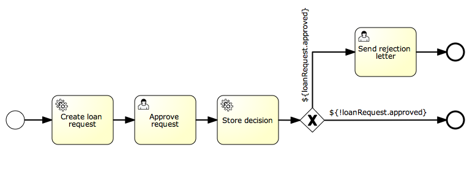

== JPA

You can use JPA-Entities as process variables, allowing you to:

* Updating existing JPA-entities based on process variables that can be filled in on a form in a userTask or generated in a serviceTask.
* Reusing existing domain model without having to write explicit services to fetch the entities and update the values
* Make decisions (gateways) based on properties of existing entities.
* ...

=== Requirements

Only entities that comply with the following are supported:

* Entities should be configured using JPA-annotations, we support both field and property-access. Mapped super classes can also be used.
* Entity should have a primary key annotated with +@Id+, compound primary keys are not supported (++@EmbeddedId++ and ++@IdClass++). The Id field/property can be of any type supported in the JPA-spec: Primitive types and their wrappers (excluding boolean), ++String++, ++BigInteger++, ++BigDecimal++, ++java.util.Date++ and ++java.sql.Date++.

[[jpaconfiguration]]

=== Configuration

To be able to use JPA-entities, the engine must have a reference to an +EntityManagerFactory+. This can be done by configuring a reference or by supplying a persistence-unit name. JPA-entities used as variables will be detected automatically and will be handled accordingly.

The example configuration below uses the jpaPersistenceUnitName:

[source,xml,linenums]
----
<bean id="processEngineConfiguration"
  class="org.activiti.engine.impl.cfg.StandaloneInMemProcessEngineConfiguration">

<!-- Database configurations -->
<property name="databaseSchemaUpdate" value="true" />
<property name="jdbcUrl" value="jdbc:h2:mem:JpaVariableTest;DB_CLOSE_DELAY=1000" />

<property name="jpaPersistenceUnitName" value="activiti-jpa-pu" />
<property name="jpaHandleTransaction" value="true" />
<property name="jpaCloseEntityManager" value="true" />

<!-- job executor configurations -->
<property name="jobExecutorActivate" value="false" />

<!-- mail server configurations -->
<property name="mailServerPort" value="5025" />
</bean>
----

The next example configuration below provides a +EntityManagerFactory+ which we define ourselves (in this case, an open-jpa entity manager). Note that the snippet only contains the beans that are relevant for the example, the others are omitted. Full working example with open-jpa entity manager can be found in the activiti-spring-examples (++/activiti-spring/src/test/java/org/activiti/spring/test/jpa/JPASpringTest.java++)

[source,xml,linenums]
----
<bean id="entityManagerFactory" class="org.springframework.orm.jpa.LocalContainerEntityManagerFactoryBean">
  <property name="persistenceUnitManager" ref="pum"/>
  <property name="jpaVendorAdapter">
    <bean class="org.springframework.orm.jpa.vendor.OpenJpaVendorAdapter">
      <property name="databasePlatform" value="org.apache.openjpa.jdbc.sql.H2Dictionary" />
    </bean>
  </property>
</bean>

<bean id="processEngineConfiguration" class="org.activiti.spring.SpringProcessEngineConfiguration">
  <property name="dataSource" ref="dataSource" />
  <property name="transactionManager" ref="transactionManager" />
  <property name="databaseSchemaUpdate" value="true" />
  <property name="jpaEntityManagerFactory" ref="entityManagerFactory" />
  <property name="jpaHandleTransaction" value="true" />
  <property name="jpaCloseEntityManager" value="true" />
  <property name="jobExecutorActivate" value="false" />
</bean>
----

The same configurations can also be done when building an engine programmatically, example:

[source,java,linenums]
----
ProcessEngine processEngine = ProcessEngineConfiguration
.createProcessEngineConfigurationFromResourceDefault()
.setJpaPersistenceUnitName("activiti-pu")
.buildProcessEngine();
----

Configuration properties:

* ++jpaPersistenceUnitName++: The name of the persistence-unit to use. (Make sure the persistence-unit is available on the classpath. According to the spec, the default location is ++/META-INF/persistence.xml++). Use either +jpaEntityManagerFactory+ or +jpaPersistenceUnitName+.
* ++jpaEntityManagerFactory++: An reference to a bean implementing +javax.persistence.EntityManagerFactory+ that will be used to load the Entities and flushing the updates. Use either _jpaEntityManagerFactory_ or _jpaPersistenceUnitName_.
* ++jpaHandleTransaction++: Flag indicating that the engine should begin and commit/rollback the transaction on the used _EntityManager_ instances. Set to false when _Java Transaction API (JTA)_ is used.
* ++jpaCloseEntityManager++: Flag indicating that the engine should close the +EntityManager+ instance that was obtained from the +EntityManagerFactory+. Set to false when the _EntityManager_ is container-managed (e.g. when using an Extended Persistence Context which isn't scoped to a single transaction').

=== Usage

==== Simple Example

Examples for using JPA variables can be found in JPAVariableTest in the Activiti source code. We'll explain +JPAVariableTest.testUpdateJPAEntityValues+ step by step.

First of all, we create an _EntityManagerFactory_ for our persistence-unit, which is based on +META-INF/persistence.xml+. This contains classes which should be included in the persistence unit and some vendor-specific configuration.

We are using a simple entity in the test, having an id and +String+ value property, which is also persisted. Before running the test, we create an entity and save this.

[source,java,linenums]
----
@Entity(name = "JPA_ENTITY_FIELD")
public class FieldAccessJPAEntity {

  @Id
  @Column(name = "ID_")
  private Long id;

  private String value;

  public FieldAccessJPAEntity() {
    // Empty constructor needed for JPA
  }

  public Long getId() {
    return id;
  }

  public void setId(Long id) {
    this.id = id;
  }

  public String getValue() {
    return value;
  }

  public void setValue(String value) {
    this.value = value;
  }
}
----

We start a new process instance, adding the entity as a variable. As with other variables, they are stored in the persistent storage of the engine. When the variable is requested the next time, it will be loaded from the +EntityManager+ based on the class and Id stored.

[source,java,linenums]
----
Map<String, Object> variables = new HashMap<String, Object>();
variables.put("entityToUpdate", entityToUpdate);

ProcessInstance processInstance = runtimeService.startProcessInstanceByKey("UpdateJPAValuesProcess", variables);
----

The first node in our process definition contains a +serviceTask+ that will invoke the method +setValue+ on +entityToUpdate+, which resolves to the JPA variable we set earlier when starting the process instance and will be loaded from the +EntityManager+ associated with the current engine's context'.

[source,xml,linenums]
----
<serviceTask id='theTask' name='updateJPAEntityTask'
  activiti:expression="${entityToUpdate.setValue('updatedValue')}" />
----

When the service-task is finished, the process instance waits in a userTask defined in the process definition, which allows us to inspect the process instance. At this point, the +EntityManager+ has been flushed and the changes to the entity have been pushed to the database. When we get the value of the variable +entityToUpdate+, it's loaded again and we get the entity with its +value+ property set to +updatedValue+.

[source,java,linenums]
----
// Servicetask in process 'UpdateJPAValuesProcess' should have set value on entityToUpdate.
Object updatedEntity = runtimeService.getVariable(processInstance.getId(), "entityToUpdate");
assertTrue(updatedEntity instanceof FieldAccessJPAEntity);
assertEquals("updatedValue", ((FieldAccessJPAEntity)updatedEntity).getValue());
----

==== Query JPA process variables

You can query for ++ProcessInstance++s and ++Execution++s that have a certain JPA-entity as variable value. *Note that only +variableValueEquals(name, entity)+ is supported for JPA-Entities on +ProcessInstanceQuery+ and +ExecutionQuery+*. Methods +variableValueNotEquals+, +variableValueGreaterThan+, +variableValueGreaterThanOrEqual+, +variableValueLessThan+ and +variableValueLessThanOrEqual+ are unsupported and will throw an +ActivitiException+ when a JPA-Entity is passed as value.

[source,java,linenums]
----
 ProcessInstance result = runtimeService.createProcessInstanceQuery()
    .variableValueEquals("entityToQuery", entityToQuery).singleResult();
----

==== Advanced example using Spring beans and JPA

A more advanced example, +JPASpringTest+, can be found in +activiti-spring-examples+. It describes the following simple use case:

* An existing Spring-bean which uses JPA entities already exists which allows for Loan Requests to be stored.
* Using Activiti, we can use the existing entities, obtained through the existing bean, and use them as variable in our process. Process is defined in the following steps:
** Service task that creates a new LoanRequest, using the existing +LoanRequestBean+ using variables received when starting the process (e.g. could come from a start form). The created entity is stored as a variable, using +activiti:resultVariable+ which stores the expression result as a variable.
** UserTask that allows a manager to review the request and approve/disapprove, which is stored as a boolean variable +approvedByManager+
** ServiceTask that updates the loan request entity so the entity is in sync with the process.
** Depending on the value of the entity property +approved+, an exclusive gateway is used to make a decision about what path to take next: When the request is approved, process ends, otherwise, an extra task will become available (Send rejection letter), so the customer can be notified manually by a rejection letter.

Please note that the process doesn't contain any forms, since it is only used in a unit test.

[source,xml,linenums]
----
<?xml version="1.0" encoding="UTF-8"?>
<definitions id="taskAssigneeExample"
  xmlns="http://www.omg.org/spec/BPMN/20100524/MODEL"
  xmlns:xsi="http://www.w3.org/2001/XMLSchema-instance"
  xmlns:activiti="http://activiti.org/bpmn"
  targetNamespace="org.activiti.examples">

  <process id="LoanRequestProcess" name="Process creating and handling loan request">
    <startEvent id='theStart' />
    <sequenceFlow id='flow1' sourceRef='theStart' targetRef='createLoanRequest' />

    <serviceTask id='createLoanRequest' name='Create loan request'
      activiti:expression="${loanRequestBean.newLoanRequest(customerName, amount)}"
      activiti:resultVariable="loanRequest"/>
    <sequenceFlow id='flow2' sourceRef='createLoanRequest' targetRef='approveTask' />

    <userTask id="approveTask" name="Approve request" />
    <sequenceFlow id='flow3' sourceRef='approveTask' targetRef='approveOrDissaprove' />

    <serviceTask id='approveOrDissaprove' name='Store decision'
      activiti:expression="${loanRequest.setApproved(approvedByManager)}" />
    <sequenceFlow id='flow4' sourceRef='approveOrDissaprove' targetRef='exclusiveGw' />

    <exclusiveGateway id="exclusiveGw" name="Exclusive Gateway approval" />
    <sequenceFlow id="endFlow1" sourceRef="exclusiveGw" targetRef="theEnd">
      <conditionExpression xsi:type="tFormalExpression">${loanRequest.approved}</conditionExpression>
    </sequenceFlow>
    <sequenceFlow id="endFlow2" sourceRef="exclusiveGw" targetRef="sendRejectionLetter">
      <conditionExpression xsi:type="tFormalExpression">${!loanRequest.approved}</conditionExpression>
    </sequenceFlow>

    <userTask id="sendRejectionLetter" name="Send rejection letter" />
    <sequenceFlow id='flow5' sourceRef='sendRejectionLetter' targetRef='theOtherEnd' />

    <endEvent id='theEnd' />
    <endEvent id='theOtherEnd' />
  </process>

</definitions>
----

Although the example above is quite simple, it shows the power of using JPA combined with Spring and parametrized method-expressions. The process requires no custom java-code at all (except for the Spring-bean off course) and speeds up development drastically.
