[[activitiDesigner]]

== Eclipse Designer

Activiti comes with an Eclipse plugin, the Activiti Eclipse Designer, that can be used to graphically model, test and deploy BPMN 2.0 processes.

[[eclipseDesignerInstallation]]

=== Installation

The following installation instructions are verified on link:$$http://www.eclipse.org/downloads/$$[Eclipse Kepler and Indigo]. Note that Eclipse Helios is *NOT* supported.

Go to *Help -> Install New Software*. In the following panel, click on _Add_ button and fill in the following fields:

* *Name:*Activiti BPMN 2.0 designer
* *Location:*http://activiti.org/designer/update/

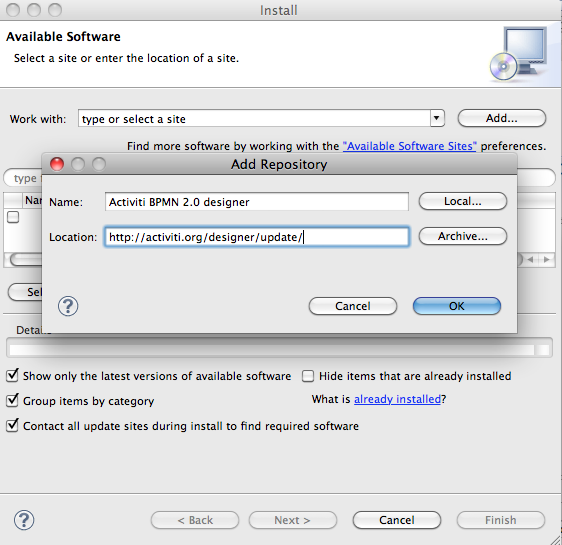

Make sure the *"Contact all updates sites.."* checkbox is *checked*, because all the necessary plugins will then be downloaded by Eclipse.

[[eclipseDesignerEditorFeatures]]

=== Activiti Designer editor features

* Create Activiti projects and diagrams.

image::images/designer.create.activiti.project.png[align="center"]

* The Activiti Designer creates a .bpmn file when creating a new Activiti diagram. When opened with the Activiti Diagram Editor view this will provide a graphical modeling canvas and palette. The same file can however be opened with an XML editor and it then shows the BPMN 2.0 XML elements of the process definition. So the Activiti Designer works with only one file for both the graphical diagram as well as the BPMN 2.0 XML. Note that in Activiti 5.9 the .bpmn extension is not yet supported as deployment artifact for a process definition. Therefore the "create deployment artifacts" feature of the Activiti Designer generates a BAR file with a .bpmn20.xml file that contains the content of the .bpmn file. You can also do a quick file rename yourself. Also note that you can open a .bpmn20.xml file with the Activiti Diagram Editor view as well.

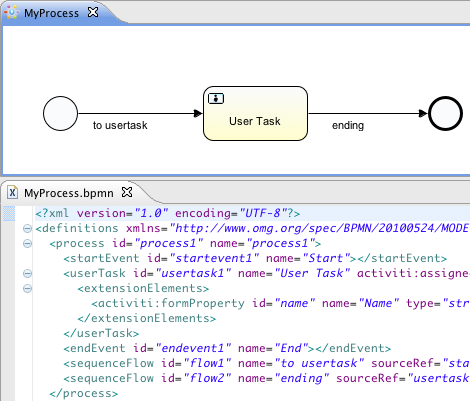

* BPMN 2.0 XML files can be imported into the Activiti Designer and a diagram will be created. Just copy the BPMN 2.0 XML file to your project and open the file with the Activiti Diagram Editor view. The Activiti Designer uses the BPMN DI information of the file to create the diagram. If you have a BPMN 2.0 XML file without BPMN DI information, no diagram can be created.

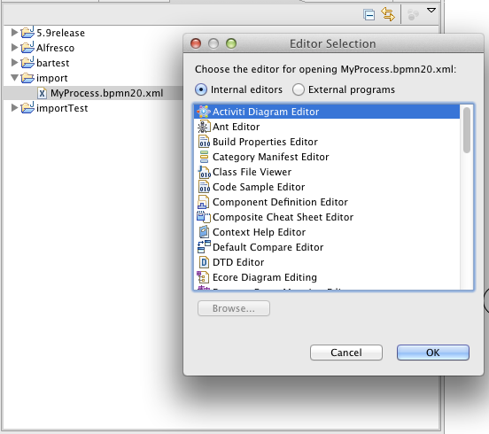

*  For deployment a BAR file and optionally a JAR file is created by the Activiti Designer by right-clicking on an Activiti project in the package explorer and choosing the _Create deployment artifacts_ option at the bottom of the popup menu. For more information about the deployment functionality of the Designer look at the <<eclipseDesignerDeployment,deployment>> section.

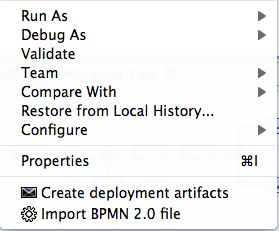

* Generate a unit test (right click on a BPMN 2.0 XML file in the package explorer and select __generate unit test__) A unit test is generated with an Activiti configuration that runs on an embedded H2 database. You can now run the unit test to test your process definition.

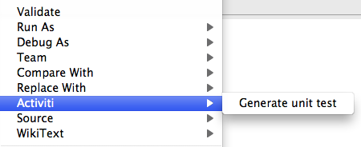

* The Activiti project is generated as a Maven project. To configure the dependencies you need to run _mvn eclipse:eclipse_ and the Maven dependencies will be configured as expected. Note that for process design Maven dependencies are not needed. They are only needed to run unit tests.

image::images/designer.project.maven.png[align="center"]

[[eclipseDesignerBPMNFeatures]]

=== Activiti Designer BPMN features

*  Support for start none event, start error event, timer start event, end none event, end error event, sequence flow,  parallel gateway, exclusive gateway, inclusive gateway, event gateway, embedded subprocess, event sub process, call activity, pool, lane,  script task, user task, service task, mail task, manual task, business rule task, receive task, timer boundary event, error boundary event, signal boundary event, timer catching event, signal catching event, signal throwing event, none throwing event and four Alfresco specific elements (user, script, mail tasks and start event).

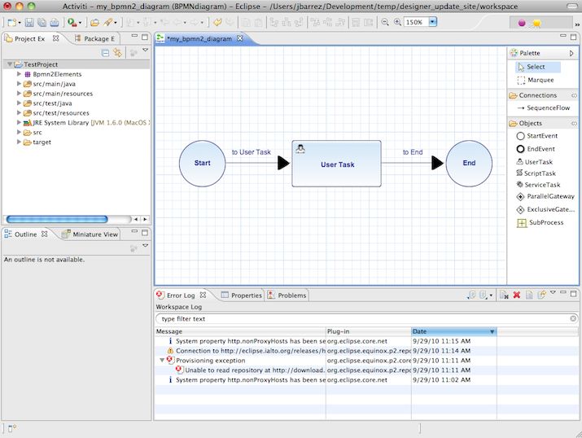

* You can quickly change the type of a task by hovering over the element and choosing the new task type.

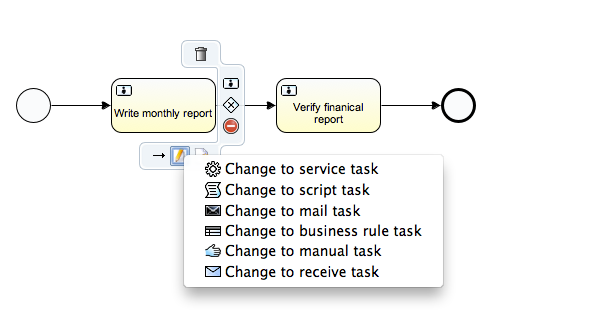

* You can quickly add new elements hovering over an element and choosing a new element type.

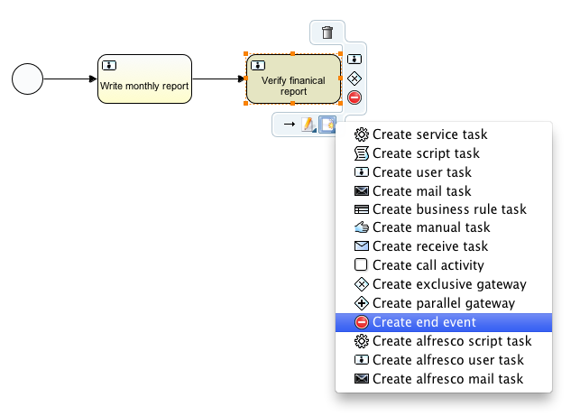

* Java class, expression or delegate expression configuration is supported for the Java service task. In addition field extensions can be configured.

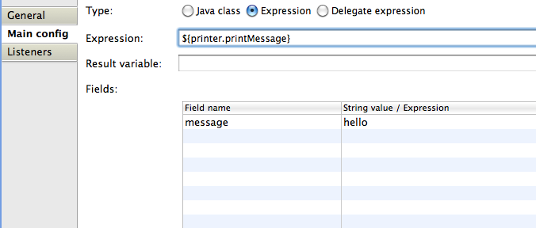

* Support for pools and lanes. Because Activiti reads different pools as different process definition, it makes the most sense to use only one pool. If you use multiple pools, be aware that drawing sequence flows between the pools will result in problems when deploying the process in the Activiti Engine. You can add as much lanes to a pool as you want.

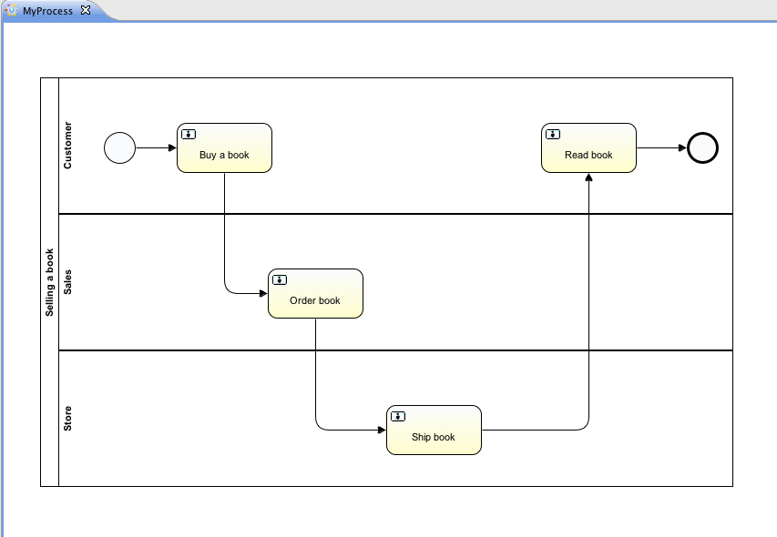

* You can add labels to sequence flows by filling the name property. You can position the labels yourself as the position is saved as part of the BPMN 2.0 XML DI information.

image::images/designer.model.labels.png[align="center"]

* Support for event sub processes.

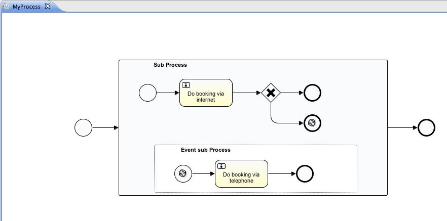

* Support for expanded embedded sub processes. You can also add an embedded sub process in another embedded sub process.

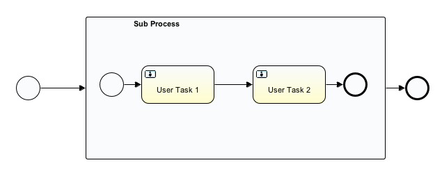

* Support for timer boundary events on tasks and embedded sub processes. Although, the timer boundary event makes the most sense when using it on a user task or an embedded sub process in the Activiti Designer.

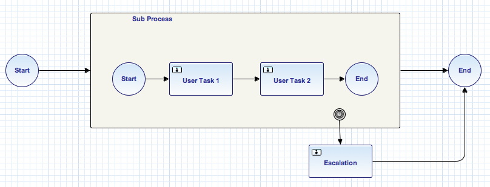

* Support for additional Activiti extensions like the Mail task, the candidate configuration of User tasks and Script task configuration.

image::images/designer.mailtask.property.png[align="center"]

* Support for the Activiti execution and task listeners. You can also add field extensions for execution listeners.

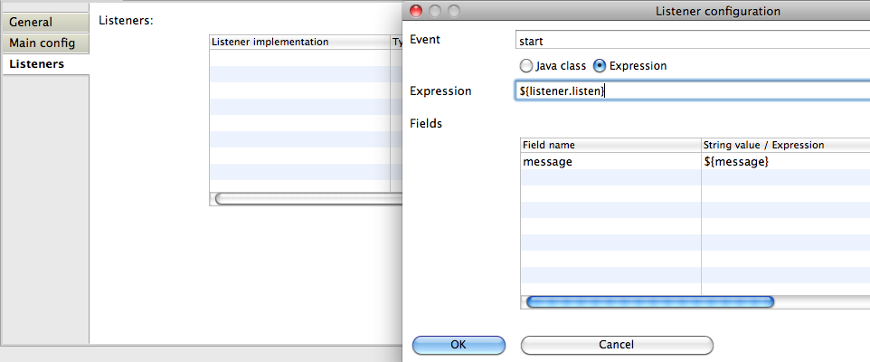

*  Support for conditions on sequence flows.

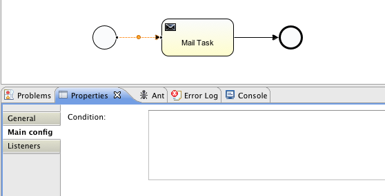

[[eclipseDesignerDeployment]]

=== Activiti Designer deployment features

Deploying process definitions and task forms on the Activiti Engine is not hard. You need a BAR file containing the process definition BPMN 2.0 XML file and optionally task forms and an image of the process that can be viewed in the Activiti Explorer. In the Activiti Designer it's made very easy to create a BAR file. When you've finished your process implementation just right-click on your Activiti project in the package explorer and choose for the *Create deployment artifacts* option at the bottom of the popup menu.

Then a deployment directory is created containing the BAR file and optionally a JAR file with the Java classes of your Activiti project.

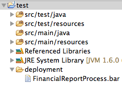

This file can now be uploaded to the Activiti Engine using the deployments tab in Activiti Explorer, and you are ready to go.

When your project contains Java classes, the deployment is a bit more work. In that case the *Create deployment artifacts* step in the Activiti Designer will also generate a JAR file containing the compiled classes. This JAR file must be deployed to the activiti-XXX/WEB-INF/lib directory in your Activiti Tomcat installation directory. This makes the classes available on the classpath of the Activiti Engine.

[[eclipseDesignerExtending]]

=== Extending Activiti Designer

You can extend the default functionality offered by Activiti Designer. This section documents which extensions are available, how they can be used and provides some usage examples. Extending Activiti Designer is useful in cases where the default functionality doesn't suit your needs, you require additional capabilities or have domain specific requirements when modeling business processes. Extension of Activiti Designer falls into two distinct categories, extending the palette and extending output formats. Each of these extension ways requires a specific approach and different technical expertise.

[NOTE]
====
Extending Activiti Designer requires technical knowledge and more specifically, knowledge of programming in Java. Depending on the type of extension you want to create, you might also need to be familiar with Maven, Eclipse, OSGi, Eclipse extensions and SWT.
====

[[eclipseDesignerCustomizingPalette]]

==== Customizing the palette

You can customize the palette that is offered to users when modeling processes. The palette is the collection of shapes that can be dragged onto the canvas in a process diagram and is displayed to the right hand side of the canvas. As you can see in the default palette, the default shapes are grouped into compartments (these are called "drawers") for Events, Gateways and so on. There are two options built-in to Activiti Designer to customize the drawers and shapes in the palette:

* Adding your own shapes / nodes to existing or new drawers
* Disabling any or all of the default BPMN 2.0 shapes offered by Activiti Designer, with the exception of the connection and selection tools

In order to customize the palette, you create a JAR file that is added to a specific installation of Activiti Designer (more on <<eclipseDesignerApplyingExtension,how to do that>> later). Such a JAR file is called an _extension_. By writing classes that are included in your extension, Activiti Designer understands which customizations you wish to make. In order for this to work, your classes should implement certain interfaces. There is an integration library available with those interfaces and base classes to extend which you should add to your project's classpath.

You can find the code examples listed below in source control with Activiti Designer. Take a look in the +examples/money-tasks+ directory in the +projects/designer+ directory of Activiti's source code.

[NOTE]
====
You can setup your project in whichever tool you prefer and build the JAR with your build tool of choice. For the instructions below, a setup is assumed with Eclipse Kepler or Indigo, using Maven (3.x) as build tool, but any setup should enable you to create the same results.
====

===== Extension setup (Eclipse/Maven)

Download and extract link:$$http://www.eclipse.org/downloads$$[Eclipse] (most recent versions should work) and a recent version (3.x) of link:$$http://maven.apache.org/download.html$$[Apache Maven]. If you use a 2.x version of Maven, you will run into problems when building your project, so make sure your version is up to date. We assume you are familiar with using basic features and the Java editor in Eclipse. It's up to you whether you prefer to use Eclipse's features for Maven or run Maven commands from a command prompt.

Create a new project in Eclipse. This can be a general project type. Create a +pom.xml+ file at the root of the project to contain the Maven project setup. Also create folders for the +src/main/java+ and +src/main/resources+ folders, which are Maven conventions for your Java source files and resources respectively. Open the +pom.xml+ file and add the following lines:

[source,xml,linenums]
----
<project
  xmlns="http://maven.apache.org/POM/4.0.0"
  xmlns:xsi="http://www.w3.org/2001/XMLSchema-instance"
  xsi:schemaLocation="http://maven.apache.org/POM/4.0.0 http://maven.apache.org/maven-v4_0_0.xsd">

  <modelVersion>4.0.0</modelVersion>

  <groupId>org.acme</groupId>
  <artifactId>money-tasks</artifactId>
  <version>1.0.0</version>
  <packaging>jar</packaging>
  <name>Acme Corporation Money Tasks</name>
...
</project>
----

As you can see, this is just a basic pom.xml file that defines a +groupId+, +artifactId+ and +version+ for the project. We will create a customization that includes a single custom node for our money business.

Add the integration library to your project's dependencies by including this dependency in your +pom.xml+ file:

[source,xml,linenums]
----
<dependencies>
  <dependency>
    <groupId>org.activiti.designer</groupId>
    <artifactId>org.activiti.designer.integration</artifactId>
    <version>5.12.0</version> <!-- Use the current Activiti Designer version -->
    <scope>compile</scope>
  </dependency>
</dependencies>
...
<repositories>
  <repository>
      <id>Activiti</id>
      <url>https://maven.alfresco.com/nexus/content/groups/public/</url>
   </repository>
</repositories>
----

Finally, in the++ pom.xml++ file, add the configuration for the ++maven-compiler-plugin++ so the Java source level is at least 1.5 (see snippet below). You will need this in order to use annotations. You can also include instructions for Maven to generate the JAR's ++MANIFEST.MF++ file. This is not required, but you can use a specific property in the manifest to provide a name for your extension (this name may be shown at certain places in the designer and is primarily intended for future use if you have several extensions in the designer). If you wish to do so, include the following snippet in ++pom.xml++:

[source,xml,linenums]
----
<build>
  <plugins>
        <plugin>
      <artifactId>maven-compiler-plugin</artifactId>
      <configuration>
        <source>1.5</source>
        <target>1.5</target>
        <showDeprecation>true</showDeprecation>
        <showWarnings>true</showWarnings>
        <optimize>true</optimize>
      </configuration>
    </plugin>
    <plugin>
      <groupId>org.apache.maven.plugins</groupId>
      <artifactId>maven-jar-plugin</artifactId>
      <version>2.3.1</version>
      <configuration>
        <archive>
          <index>true</index>
          <manifest>
            <addClasspath>false</addClasspath>
            <addDefaultImplementationEntries>true</addDefaultImplementationEntries>
          </manifest>
          <manifestEntries>
            <ActivitiDesigner-Extension-Name>Acme Money</ActivitiDesigner-Extension-Name>
          </manifestEntries>
        </archive>
      </configuration>
    </plugin>
  </plugins>
</build>
----

The name for the extension is described by the +ActivitiDesigner-Extension-Name+ property. The only thing left to do now is tell Eclipse to setup the project according to the instructions in +pom.xml+. So open up a command shell and go to the root folder of your project in the Eclipse workspace. Then execute the following Maven command:

----
mvn eclipse:eclipse
----

Wait until the build is successful. Refresh the project (use the project's context menu (right-click) and select ++Refresh++). You should now have the +src/main/java+ and +src/main/resources+ folders as source folders in the Eclipse project.

[NOTE]
====
You can of course also use the link:$$http://www.eclipse.org/m2e$$[m2eclipse] plugin and simply enable Maven dependency management from the context menu (right-click) of the project. Then choose +Maven+ > +Update project configuration+ from the project's context menu. That should setup the source folders as well.
====

That's it for the setup. Now you're ready to start creating customizations to Activiti Designer!

[[eclipseDesignerApplyingExtension]]

===== Applying your extension to Activiti Designer

You might be wondering how you can add your extension to Activiti Designer so your customizations are applied. These are the steps to do just that:
* Once you've created your extension JAR (for instance, by performing a mvn install in your project to build it with Maven), you need to transfer the extension to the computer where Activiti Designer is installed;
* Store the extension somewhere on the hard drive where it will be able to remain and remember the location. _Note:_ the location must be outside the Eclipse workspace of Activiti Designer - storing the extension inside the workspace will lead to the user getting a popup error message and the extensions being unavailable;
* Start Activiti Designer and from the menu, select +Window+ > +Preferences+
* In the preferences screen, type +user+ as keyword. You should see an option to access the +User Libraries+ in Eclipse in the +Java+ section.

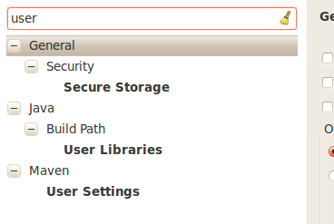

* Select the User Libraries item and a tree view shows up to the right where you can add libraries. You should see the default group where you can add extensions to Activiti Designer (depending on your Eclipse installation, you might see several others as well).

image::images/designer.preferences.userlibraries.activiti.empty.png[align="center"]

* Select the +Activiti Designer Extensions+ group and click the +Add JARs...+ button. Navigate to the folder where your extension is stored and select the extension file you want to add. After completing this, your preferences screen should show the extension as part of the +Activiti Designer Extensions+ group, as shown below.

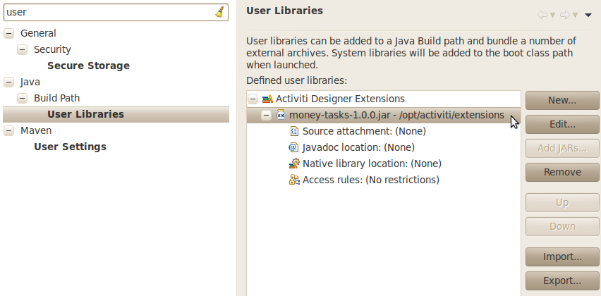

* Click the +OK+ button to save and close the preferences dialog. The +Activiti Designer Extensions+ group is automatically added to new Activiti projects you create. You can see the user library as entry in the project's tree in the Navigator or Package Explorer. If you already had Activiti projects in the workspace, you should also see the new extensions show up in the group. An example is shown below.

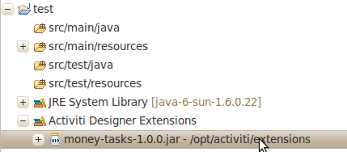

Diagrams you open will now have the shapes from the new extension in their palette (or shapes disabled, depending on the customizations in your extension). If you already had a diagram opened, close and reopen it to see the changes in the palette.

===== Adding shapes to the palette

With your project set up, you can now easily add shapes to the palette. Each shape you wish to add is represented by a class in your JAR. Take note that these classes are not the classes that will be used by the Activiti engine during runtime. In your extension you describe the properties that can be set in Activiti Designer for each shape. From these shapes, you can also define the runtime characteristics that should be used by the engine when a process instance reaches the node in the process. The runtime characteristics can use any of the options that Activiti supports for regular ++ServiceTask++s. See <<eclipseDesignerConfiguringRuntime,this section>> for more details.

A shape's class is a simple Java class, to which a number of annotations are added. The class should implement the +CustomServiceTask+ interface, but you shouldn't implement this interface yourself. Extend the +AbstractCustomServiceTask+ base class instead (at the moment you MUST extend this class directly, so no abstract classes in between). In the Javadoc for that class you can find instructions on the defaults it provides and when you should override any of the methods it already implements. Overrides allow you to do things such as providing icons for the palette and in the shape on the canvas (these can be different) and specifying the base shape you want the node to have (activity, event, gateway).

[source,java,linenums]
----
/**
 * @author John Doe
 * @version 1
 * @since 1.0.0
 */
public class AcmeMoneyTask extends AbstractCustomServiceTask {
...
}
----

You will need to implement the +getName()+ method to determine the name the node will have in the palette. You can also put the nodes in their own drawer and provide an icon. Override the appropriate methods from +AbstractCustomServiceTask+. If you want to provide an icon, make sure it's in the +src/main/resources+ package in your JAR and is about 16x16 pixels and a JPEG or PNG format. The path you supply is relative to that folder.

You can add properties to the shape by adding members to the class and annotating them with the +@Property+ annotation like this:

[source,java,linenums]
----
@Property(type = PropertyType.TEXT, displayName = "Account Number")
@Help(displayHelpShort = "Provide an account number", displayHelpLong = HELP_ACCOUNT_NUMBER_LONG)
private String accountNumber;
----

There are several +PropertyType+ values you can use, which are described in more detail in <<eclipseDesignerPropertyTypes,this section>>. You can make a field required by setting the required attribute to true. A message and red background will appear if the user doesn't fill out the field.

If you want to ensure the order of the various properties in your class as they appear in the property screen, you should specify the order attribute of the +@Property+ annotation.

As you can see, there's also a +@Help+ annotation that's used to provide the user some guidance when filling out the field. You can also use the +@Help+ annotation on the class itself - this information is shown at the top of the property sheet presented to the user.

Below is the listing for a further elaboration of the +MoneyTask+. A comment field has been added and you can see an icon is included for the node.

[source,java,linenums]
----
/**
 * @author John Doe
 * @version 1
 * @since 1.0.0
 */
@Runtime(javaDelegateClass = "org.acme.runtime.AcmeMoneyJavaDelegation")
@Help(displayHelpShort = "Creates a new account", displayHelpLong = "Creates a new account using the account number specified")
public class AcmeMoneyTask extends AbstractCustomServiceTask {

  private static final String HELP_ACCOUNT_NUMBER_LONG = "Provide a number that is suitable as an account number.";

  @Property(type = PropertyType.TEXT, displayName = "Account Number", required = true)
  @Help(displayHelpShort = "Provide an account number", displayHelpLong = HELP_ACCOUNT_NUMBER_LONG)
  private String accountNumber;

  @Property(type = PropertyType.MULTILINE_TEXT, displayName = "Comments")
  @Help(displayHelpShort = "Provide comments", displayHelpLong = "You can add comments to the node to provide a brief description.")
  private String comments;

  /*
   * (non-Javadoc)
   *
   * @see org.activiti.designer.integration.servicetask.AbstractCustomServiceTask #contributeToPaletteDrawer()
   */
  @Override
  public String contributeToPaletteDrawer() {
    return "Acme Corporation";
  }

  @Override
  public String getName() {
    return "Money node";
  }

  /*
   * (non-Javadoc)
   *
   * @see org.activiti.designer.integration.servicetask.AbstractCustomServiceTask #getSmallIconPath()
   */
  @Override
  public String getSmallIconPath() {
    return "icons/coins.png";
  }
}
----

If you extend Activiti Designer with this shape, The palette and corresponding node will look like this:

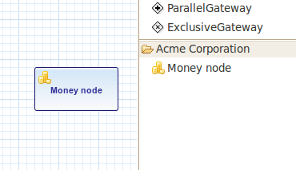

The properties screen for the money task is shown below. Note the required message for the +accountNumber+ field.

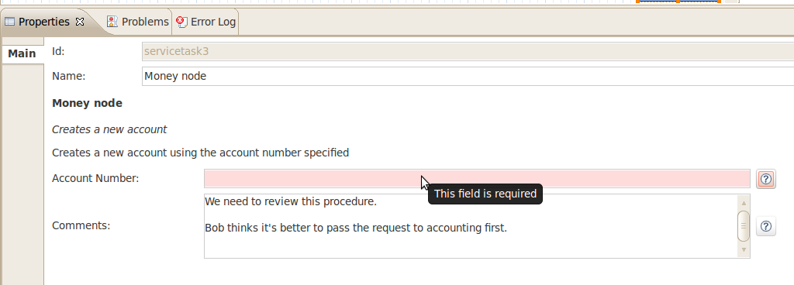

Users can enter static text or use expressions that use process variables in the property fields when creating diagrams (e.g. "This little piggy went to ${piggyLocation}"). Generally, this applies to text fields where users are free to enter any text. If you expect users to want to use expressions and you apply runtime behavior to your +CustomServiceTask+ (using ++@Runtime++), make sure to use +Expression+ fields in the delegate class so the expressions are correctly resolved at runtime. More information on runtime behavior can be found in <<eclipseDesignerConfiguringRuntime,this section>>.

The help for fields is offered by the buttons to the right of each property. Clicking on the button shows a popup as displayed below.

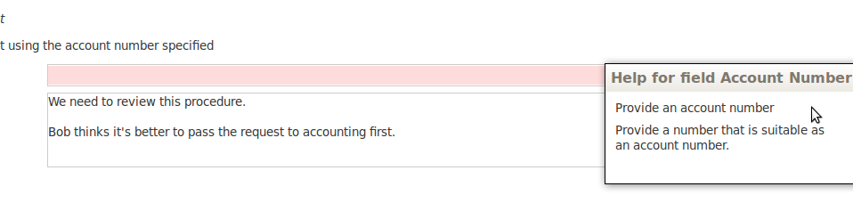

[[eclipseDesignerConfiguringRuntime]]

====== Configuring runtime execution of Custom Service Tasks

With your fields setup and your extension applied to Designer, users can configure the properties of the service task when modelling a process. In most cases, you will want to use these user-configured properties when the process is executed by Activiti. To do this, you must instruct Activiti which class to instantiate when the process reaches your +CustomServiceTask+.

There is a special annotation for specifying the runtime characteristics of your +CustomServiceTask+, the +@Runtime+ annotation. Here's an example of how to use it:

[source,java,linenums]
----
@Runtime(javaDelegateClass = "org.acme.runtime.AcmeMoneyJavaDelegation")
----

Your +CustomServiceTask+ will result in a normal +ServiceTask+ in the BPMN output of processes modelled with it. Activiti enables <<bpmnJavaServiceTask,several ways>> to define the runtime characteristics of ++ServiceTask++s. Therefore, the +@Runtime+ annotation can take one of three attributes, which match directly to the options Activiti provides, like this:

* +javaDelegateClass+ maps to +activiti:class+ in the BPMN output. Specify the fully qualified classname of a class that implements +JavaDelegate+.
* +expression+ maps to +activiti:expression+ in the BPMN output. Specify an expression to a method to be executed, such as a method in a Spring Bean. You should _not_ specify any +@Property+ annotations on fields when using this option. For more information, see below.
* +javaDelegateExpression+ maps to +activiti:delegateExpression+ in the BPMN output. Specify an expression to  a class that implements +JavaDelegate+.

The user's property values will be injected into the runtime class if you provide members in the class for Activiti to inject into. The names should match the names of the members in your +CustomServiceTask+. For more information, consult <<serviceTaskFieldInjection,this part>> of the userguide. Note that since version 5.11.0 of the Designer you can use the +Expression+ interface for dynamic field values. This means that the value of the property in the Activiti Designer must contain an expression and this expression will then be injected into an +Expression+ property in the +JavaDelegate+ implementation class.

[NOTE]
====

You can use +@Property+ annotations on members of your +CustomServiceTask+, but this will not work if you use ++@Runtime++'s +expression+ attribute. The reason for this is that the expression you specify will be attempted to be resolved to a _method_ by Activiti, not to a class. Therefore, no injection into a class will be performed. Any members marked with +@Property+ will be ignored by Designer if you use +expression+ in your +@Runtime+ annotation. Designer will not render them as editable fields in the node's property pane and will produce no output for the properties in the process' BPMN.
====

[NOTE]
====
Note that the runtime class shouldn't be in your extension JAR, as it's dependent on the Activiti libraries. Activiti needs to be able to find it at runtime, so it needs to be on the Activiti engine's classpath.
====

The examples project in Designer's source tree contains examples of the different options for configuring +@Runtime+. Take a look in the money-tasks project for some starting points. The examples refer to delegate class examples that are in the money-delegates project.

[[eclipseDesignerPropertyTypes]]

===== Property types

This section describes the property types you can use for a +CustomServiceTask+ by setting its type to a +PropertyType+ value.

====== PropertyType.TEXT

Creates a single line text field as shown below. Can be a required field and shows validation messages as a tooltip. Validation failures are displayed by changing the background of the field to a light red color.

====== PropertyType.MULTILINE_TEXT

Creates a multiline text field as shown below (height is fixed at 80 pixels). Can be a required field and shows validation messages as a tooltip. Validation failures are displayed by changing the background of the field to a light red color.

====== PropertyType.PERIOD

Creates a structured editor for specifying a period of time by editing amounts of each unit with a spinner control. The result is shown below. Can be a required field (which is interpreted such that not all values may be 0, so at least 1 part of the period must have a non-zero value) and shows validation messages as a tooltip. Validation failures are displayed by changing the background of the entire field to a light red color. The value of the field is stored as a string of the form 1y 2mo 3w 4d 5h 6m 7s, which represents 1 year, 2 months, 3 weeks, 4 days, 6 minutes and 7 seconds. The entire string is always stored, even if parts are 0.

====== PropertyType.BOOLEAN_CHOICE

Creates a single checkbox control for boolean or toggle choices. Note that you can specify the +required+ attribute on the +Property+ annotation, but it will not be evaluated because that would leave the user without a choice whether to check the box or not. The value stored in the diagram is java.lang.Boolean.toString(boolean), which results in "true" or "false".

image::images/designer.property.boolean.choice.png[align="center"]

====== PropertyType.RADIO_CHOICE

Creates a group of radio buttons as shown below. Selection of any of the radio buttons is mutually exclusive with selection of any of the others (i.e., only one selection allowed). Can be a required field and shows validation messages as a tooltip. Validation failures are displayed by changing the background of the group to a light red color.

This property type expects the class member you have annotated to also have an accompanying +@PropertyItems+ annotation (for an example, see below). Using this additional annotation, you can specify the list of items that should be offered in an array of Strings. Specify the items by adding two array entries for each item: first, the label to be shown; second, the value to be stored.

[source,java,linenums]
----
@Property(type = PropertyType.RADIO_CHOICE, displayName = "Withdrawl limit", required = true)
@Help(displayHelpShort = "The maximum daily withdrawl amount ", displayHelpLong = "Choose the maximum daily amount that can be withdrawn from the account.")
@PropertyItems({ LIMIT_LOW_LABEL, LIMIT_LOW_VALUE, LIMIT_MEDIUM_LABEL, LIMIT_MEDIUM_VALUE, LIMIT_HIGH_LABEL, LIMIT_HIGH_VALUE })
private String withdrawlLimit;
----

image::images/designer.property.radio.choice.invalid.png[align="center"]

====== PropertyType.COMBOBOX_CHOICE

Creates a combobox with fixed options as shown below. Can be a required field and shows validation messages as a tooltip. Validation failures are displayed by changing the background of the combobox to a light red color.

This property type expects the class member you have annotated to also have an accompanying +@PropertyItems+ annotation (for an example, see below). Using this additional annotation, you can specify the list of items that should be offered in an array of Strings. Specify the items by adding two array entries for each item: first, the label to be shown; second, the value to be stored.

[source,java,linenums]
----
@Property(type = PropertyType.COMBOBOX_CHOICE, displayName = "Account type", required = true)
@Help(displayHelpShort = "The type of account", displayHelpLong = "Choose a type of account from the list of options")
@PropertyItems({ ACCOUNT_TYPE_SAVINGS_LABEL, ACCOUNT_TYPE_SAVINGS_VALUE, ACCOUNT_TYPE_JUNIOR_LABEL, ACCOUNT_TYPE_JUNIOR_VALUE, ACCOUNT_TYPE_JOINT_LABEL,
  ACCOUNT_TYPE_JOINT_VALUE, ACCOUNT_TYPE_TRANSACTIONAL_LABEL, ACCOUNT_TYPE_TRANSACTIONAL_VALUE, ACCOUNT_TYPE_STUDENT_LABEL, ACCOUNT_TYPE_STUDENT_VALUE,
  ACCOUNT_TYPE_SENIOR_LABEL, ACCOUNT_TYPE_SENIOR_VALUE })
private String accountType;
----

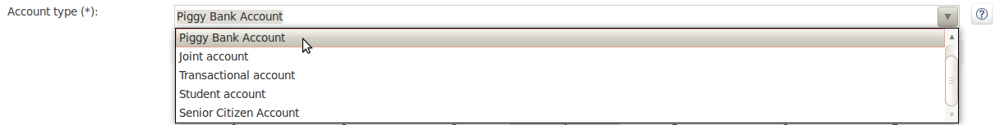

====== PropertyType.DATE_PICKER

Creates a date selection control as shown below. Can be a required field and shows validation messages as a tooltip (note, that the control used will auto-set the selection to the date on the system, so the value is seldom empty). Validation failures are displayed by changing the background of the control to a light red color.

This property type expects the class member you have annotated to also have an accompanying +@DatePickerProperty+ annotation (for an example, see below). Using this additional annotation, you can specify the date time pattern to be used to store dates in the diagram and the type of datepicker you would like to be shown. Both attributes are optional and have default values that will be used if you don't specify them (these are static variables in the +DatePickerProperty+ annotation). The +dateTimePattern+ attribute should be used to supply a pattern to the +SimpleDateFormat+ class. When using the +swtStyle+ attribute, you should specify an integer value that is supported by ++SWT++'s +DateTime+ control, because this is the control that is used to render this type of property.

[source,java,linenums]
----
@Property(type = PropertyType.DATE_PICKER, displayName = "Expiry date", required = true)
@Help(displayHelpShort = "The date the account expires ", displayHelpLong = "Choose the date when the account will expire if no extended before the date.")
@DatePickerProperty(dateTimePattern = "MM-dd-yyyy", swtStyle = 32)
private String expiryDate;
----

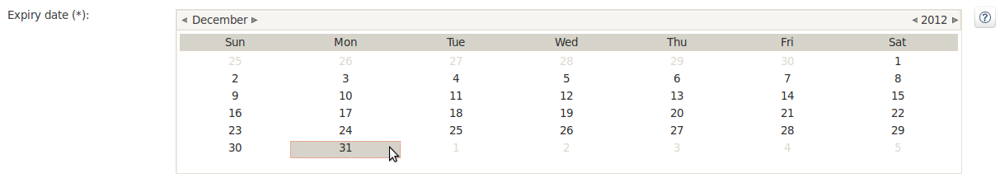

====== PropertyType.DATA_GRID

Creates a data grid control as shown below. A data grid can be used to allow the user to enter an arbitrary amount of rows of data and enter values for a fixed set of columns in each of those rows (each individual combination of row and column is referred to as a cell). Rows can be added and removed as the user sees fit.

This property type expects the class member you have annotated to also have an accompanying +@DataGridProperty+ annotation (for an example, see below). Using this additional annotation, you can specify some specific attributes of the data grid. You are required to reference a different class to determine which columns go into the grid with the +itemClass+ attribute. Activiti Designer expects the member type to be a +List+. By convention, you can use the class of the +itemClass+ attribute as its generic type. If, for example, you have a grocery list that you edit in the grid, you would define the columns of the grid in the +GroceryListItem+ class. From your +CustomServiceTask+, you would refer to it like this:

[source,java,linenums]
----
@Property(type = PropertyType.DATA_GRID, displayName = "Grocery List")
@DataGridProperty(itemClass = GroceryListItem.class)
private List<GroceryListItem> groceryList;
----

The "itemClass" class uses the same annotations you would otherwise use to specify fields of a +CustomServiceTask+, with the exception of using a data grid. Specifically, +TEXT+, +$$MULTILINE_TEXT$$+ and +PERIOD+ are currently supported. You'll notice the grid will create single line text controls for each field, regardless of the +PropertyType+. This is done on purpose to keep the grid graphically appealing and readable. If you consider the regular display mode for a +PERIOD+ +PropertyType+ for instance, you can imagine it would never properly fit in a grid cell without cluttering the screen. For +$$MULTILINE_TEXT$$+ and +PERIOD+, a double-click mechanism is added to each field which pops up a larger editor for the +PropertyType+. The value is stored to the field after the user clicks OK and is therefore readable within the grid.

Required attributes are handled in a similar manner to regular fields of type +TEXT+ and the entire grid is validated as soon as any field loses focus. The background color of the text control in a specific cell of the data grid is changed to light red if there are validation failures.

By default, the component allows the user to add rows, but not to determine the order of those rows. If you wish to allow this, you should set the +orderable+ attribute to true, which enables buttons at the end of each row to move it up or down in the grid.

[NOTE]
====
At the moment, this property type is not correctly injected into your runtime class.
====

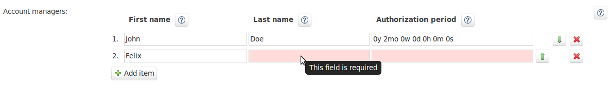

===== Disabling default shapes in the palette

This customization requires you to include a class in your extension that implements the +DefaultPaletteCustomizer+ interface. You should not implement this interface directly, but subclass the +AbstractDefaultPaletteCustomizer+ base class. Currently, this class provides no functionality, but future versions of the +DefaultPaletteCustomizer+ interface will offer more capabilities for which this base class will provide some sensible defaults so it's best to subclass so your extension will be compatible with future releases.

Extending the +AbstractDefaultPaletteCustomizer+ class requires you to implement one method, +disablePaletteEntries()+, from which you must return a list of +PaletteEntry+ values. For each of the default shapes, you can disable it by adding its corresponding +PaletteEntry+ value to your list. Note that if you remove shapes from the default set and there are no remaining shapes in a particular drawer, that drawer will be removed from the palette in its entirety. If you wish to disable all of the default shapes, you only need to add +PaletteEntry.ALL+ to your result. As an example, the code below disables the Manual task and Script task shapes in the palette.

[source,java,linenums]
----
public class MyPaletteCustomizer extends AbstractDefaultPaletteCustomizer {

  /*
   * (non-Javadoc)
   *
   * @see org.activiti.designer.integration.palette.DefaultPaletteCustomizer#disablePaletteEntries()
   */
  @Override
  public List<PaletteEntry> disablePaletteEntries() {
    List<PaletteEntry> result = new ArrayList<PaletteEntry>();
    result.add(PaletteEntry.MANUAL_TASK);
    result.add(PaletteEntry.SCRIPT_TASK);
    return result;
  }

}
----

The result of applying this extension is shown in the picture below. As you can see, the manual task and script task shapes are no longer available in the +Tasks+ drawer.

image::images/designer.palette.disable.manual.and.script.png[align="center"]

To disable all of the default shapes, you could use something similar to the code below.

[source,java,linenums]
----
public class MyPaletteCustomizer extends AbstractDefaultPaletteCustomizer {

  /*
   * (non-Javadoc)
   *
   * @see org.activiti.designer.integration.palette.DefaultPaletteCustomizer#disablePaletteEntries()
   */
  @Override
  public List<PaletteEntry> disablePaletteEntries() {
    List<PaletteEntry> result = new ArrayList<PaletteEntry>();
    result.add(PaletteEntry.ALL);
    return result;
  }

}
----

The result will look like this (notice that the drawers the default shapes were in are no longer in the palette):

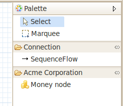

==== Validating diagrams and exporting to custom output formats

Besides customizing the palette, you can also create extensions to Activiti Designer that can perform validations and save information from the diagram to custom resources in the Eclipse workspace. There are built-in extension points for doing this and this section explains how to use them.

[NOTE]
====
The ExportMarshaller functions were reintroduced recently. We are still working on the validation functionality. The documentation below details the old situation and will be updated when the new functionality is available.
====

Activiti Designer allows you to write extensions that validate diagrams. There are already validations of BPMN constructs in the tool by default, but you can add your own if you want to validate additional items such as modeling conventions or the values in properties of ++CustomServiceTask++s. These extensions are known as +Process Validators+.

You can also Activiti Designer to publish to additional formats when saving diagrams. These extensions are called +Export Marshallers+ and are invoked automatically by Activiti Designer on each save action by the user. This behavior can be enabled or disabled by setting a preference in Eclipse's preferences dialog for each format for which there is an extension detected. Designer will make sure your +ExportMarshaller+ is invoked when saving the diagram, depending on the user's preference.

Often, you will want to combine a +ProcessValidator+ and an +ExportMarshaller+. Let's say you have a number of ++CustomServiceTask++s in use that have properties you would like to use in the process that gets generated. However, before the process is generated, you want to validate some of those values first. Combining a +ProcessValidator+ and +ExportMarshaller+ is the best way to accomplish this and Activiti Designer enables you to plug your extensions into the tool seamlessly.

To create a +ProcessValidator+ or an +ExportMarshaller+, you need to create a different kind of extension than for extending the palette. The reason for this is simple: from your code you will need access to more APIs than those that are offered by the integration library. In particular, you will need classes that are available in Eclipse itself. So to get started, you should create an Eclipse plugin (which you can do by using Eclipse's PDE support) and package it in a custom Eclipse product or feature. It's beyond the scope of this user guide to explain all the details involved in developing Eclipse plugins, so the instructions below are limited to the functionality for extending Activiti Designer.

Your bundle should be dependent on the following libraries:

* org.eclipse.core.runtime
* org.eclipse.core.resources
* org.activiti.designer.eclipse
* org.activiti.designer.libs
* org.activiti.designer.util

Optionally, the org.apache.commons.lang bundle is available through Designer if you'd like to use that in your extension.

Both ++ProcessValidator++s and ++ExportMarshaller++s are created by extending a base class. These base classes inherit some useful methods from their superclass, the +AbstractDiagramWorker+ class. Using these methods you can create information, warning and error markers that show up in Eclipse's problems view for the user to figure out what's wrong or important. You can get to information about the diagram in the form of +Resources+ and +InputStreams+. This information is provided from the +DiagramWorkerContext+, which is available from the +AbstractDiagramWorker+ class.

It's probably a good idea to invoke +clearMarkers()+ as one of the first things you do in either a +ProcessValidator+ or an ++ExportMarshaller++; this will clear any previous markers for your worker (markers are automatically linked to the worker and clearing markers for one worker leaves other markers untouched). For example:

[source,java,linenums]
----
// Clear markers for this diagram first
clearMarkersForDiagram();
----

You should also use the progress monitor provided (in the ++DiagramWorkerContext++) to report your progress back to the user because validations and/or marshalling actions can take up some time during which the user is forced to wait. Reporting progress requires some knowledge of how you should use Eclipse's features. Take a look at link:$$http://www.eclipse.org/articles/Article-Progress-Monitors/article.html$$[this article] for a thorough explanation of the concepts and usage.

===== Creating a ProcessValidator extension

[NOTE]
====
Under review!
====

Create an extension to the +org.activiti.designer.eclipse.extension.validation.ProcessValidator+ extension point in your +plugin.xml+ file. For this extension point, you are required to subclass the +AbstractProcessValidator+ class.

[source,xml,linenums]
----
<?eclipse version="3.6"?>
<plugin>
  <extension
    point="org.activiti.designer.eclipse.extension.validation.ProcessValidator">
    <ProcessValidator
      class="org.acme.validation.AcmeProcessValidator">
    </ProcessValidator>
  </extension>
</plugin>
----

[source,java,linenums]
----
public class AcmeProcessValidator extends AbstractProcessValidator {
}
----

You have to implement a number of methods. Most importantly, implement +getValidatorId()+ so you return a globally unique ID for your validator. This will enable you to invoke it from and +ExportMarshaller+, or event let someone _else_ invoke your validator from their +ExportMarshaller+. Implement +getValidatorName()+ and return a logical name for your validator. This name is shown to the user in dialogs. In +getFormatName()+, you can return the type of diagram the validator typically validates.

The validation work itself is done in the +validateDiagram()+ method. From this point on, it's up to your specific functionality what you code here. Typically, however, you will want to start by getting hold of the nodes in the diagram's process, so you can iterate through them, collect, compare and validate data. This snippet shows you how to do this:

[source,java,linenums]
----
final EList<EObject> contents = getResourceForDiagram(diagram).getContents();
for (final EObject object : contents) {
  if (object instanceof StartEvent ) {
  // Perform some validations for StartEvents
  }
  // Other node types and validations
}
----

Don't forget to invoke +addProblemToDiagram()+ and/or +addWarningToDiagram()+, etc as you go through your validations. Make sure you return a correct boolean result at the end to indicate whether you consider the validation as succeeded or failed. This can be used by and invoking +ExportMarshaller+ to determine the next course of action.

===== Creating an ExportMarshaller extension

Create an extension to the +org.activiti.designer.eclipse.extension.ExportMarshaller+ extension point in your +plugin.xml+ file. For this extension point, you are required to subclass the +AbstractExportMarshaller+ class. This abstract base class provides you with a number of useful methods when marshalling to your own format, but most importantly it allows you to save resources to the workspace and to invoke validators.

An example implementation is available in Designer's examples folder. This example shows how to use the methods in the base class to get the basics done, such as accessing the diagram's +InputStream+, using its +BpmnModel+ and saving resources to the workspace.

[source,xml,linenums]
----
<?eclipse version="3.6"?>
<plugin>
  <extension
    point="org.activiti.designer.eclipse.extension.ExportMarshaller">
    <ExportMarshaller
      class="org.acme.export.AcmeExportMarshaller">
    </ExportMarshaller>
  </extension>
  </plugin>
----

[source,java,linenums]
----
public class AcmeExportMarshaller extends AbstractExportMarshaller {
}
----

You are required to implement some methods, such as +getMarshallerName()+ and +getFormatName()+. These methods are used to display options to the user and to show information in progress dialogs, so make sure the descriptions you return reflect the functionality you are implementing.

The bulk of your work is performed in the +doMarshallDiagram()+ method.

If you want to perform a certain validation first, you can invoke the validator directly from your marshaller. You receive a boolean result from the validator, so you know whether validation succeeded. In most cases you won't want to proceed with marshalling the diagram if it's not valid, but you might choose to go ahead anyway or even create a different resource if validation fails.

Once you have all the data you need, you should invoke the +saveResource()+ method to create a file containing your data. You can invoke +saveResource()+ as many times as you wish from a single ExportMarshaller; a marshaller can therefore be used to create more than one output file.

You can construct a filename for your output resource(s) by using the +saveResource()+ method in the +AbstractDiagramWorker+ class. There are a couple of useful variables you can have parsed, allowing you to create filenames such as _original-filename__my-format-name.xml. These variables are described in the Javadocs and defined by the +ExportMarshaller+ interface. You can also use +resolvePlaceholders()+ on a string (e.g. a path) if you want to parse the placeholders yourself. +getURIRelativeToDiagram()+ will invoke this for you.

You should use the progress monitor provided to report your progress back to the user. How to do this is described in link:$$http://www.eclipse.org/articles/Article-Progress-Monitors/article.html$$[this article].
