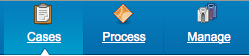
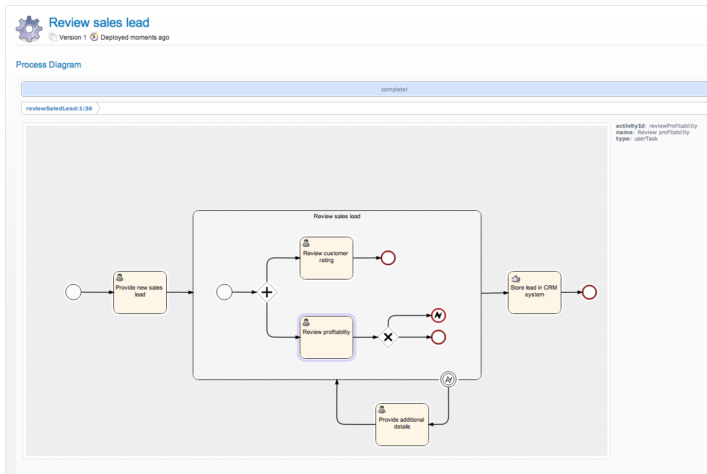
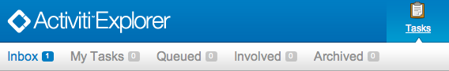
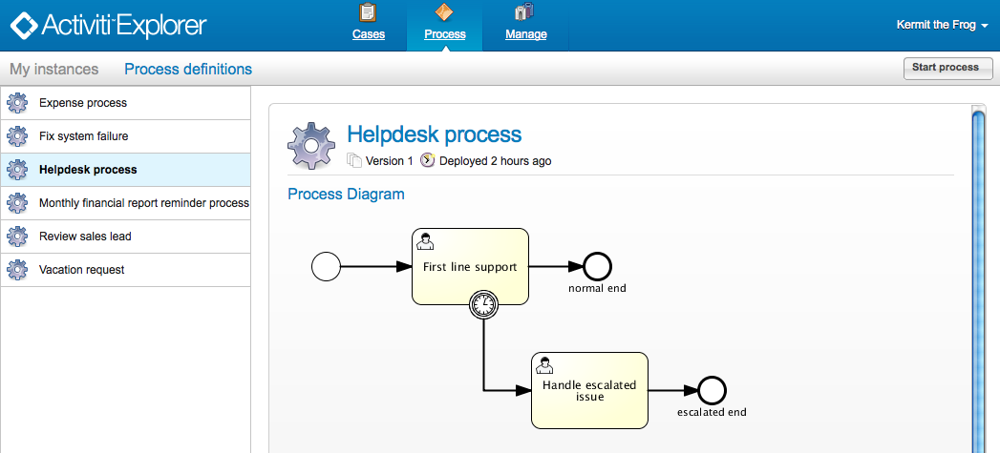
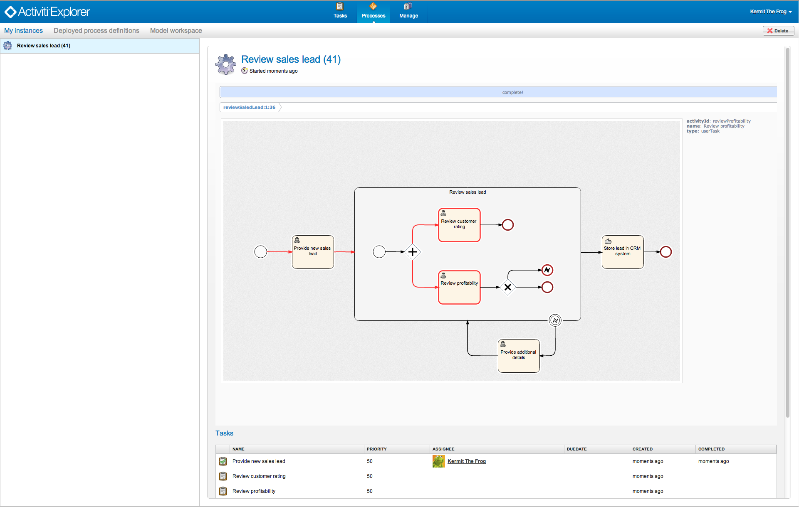
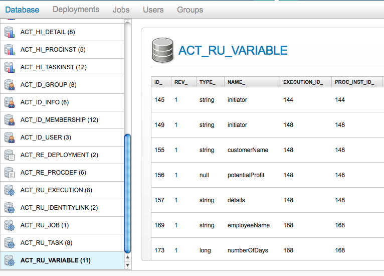
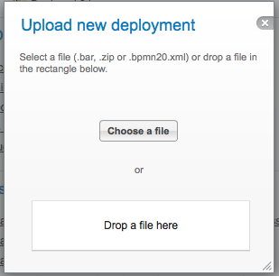
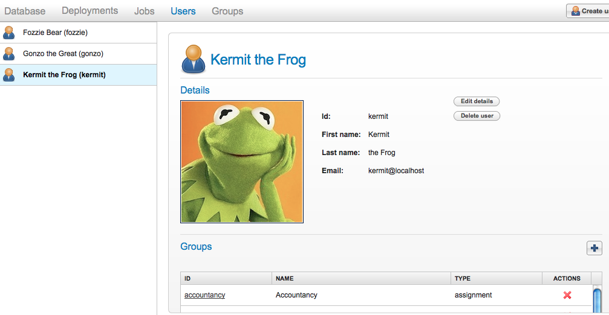
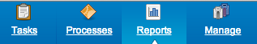

[[activitiExplorer]]

== Activiti Explorer

Activiti Explorer is a web application that is included when you download Activiti from the Activiti website. The purpose of Explorer is not a finished, end-user ready application, but  rather to exercise and show the functionality of Activiti. As such, Explorer is meant as a demo, or maybe inspiration for people using Activiti in their own applications. Out of the box, Explorer  uses an in-memory database, but it is easy to switch to your own database (see the applicationContext files in the WEB-INF folder).
 
After logging into the application, you will see three large icons that show the main capabilities.

    
*  *Tasks*: Task management functionality. Here you can see user tasks from running processes that are assigned to you, or see group tasks which you can claim. Explorer allows to relate content, divide work into subtasks, involve people in different roles, etc ... Explorer can also be used to create standalone tasks that are not related to any process.
* *Process*: shows the deployed process definitions, and allows to start new process instances.
* *Reporting*: generate reports and view previously  saved results. See <<explorer.reporting,the section on reporting>> for more details.
* *Manage*: only visible when the logged in user has  administrator rights. Allows to administrate the Activiti engine: manage users and groups, execute and see stuck jobs, see the database and deploy new process definitions.        

=== Configuration

The Activiti Explorer is using Spring Java Configuration for starting the Activiti Engine. A small amount of properties can be defined by changing the engine.properties file you can find in the WEB-INF/classes folder.
If you need more advanced configuration options there's the possibility to define the Activiti process engine configuration in XML in the activiti-custom-context.xml file you can also find in the WEB-INF/classes folder.
An example configuration is already in comments in this file.

=== Process diagram

The Explorer includes functionality to dynamically generate an overview of a process definition using the link:$$http://raphaeljs.com/$$[Raphaël] JavaScript framework. This process image can only be generated when the process definition XML contains BPMN DI information. When there's no BPMN DI information in the process definition XML and the deployment contains a process definition image, that image will be shown.

      
When you don't want to use the JavaScript process definition overview you can disable it in the ui.properties file

[source,properties,linenums]      
----
activiti.ui.jsdiagram = false
----

In addition to showing the process diagram in the Explorer it's also easy to include the process diagram anywhere you want. The following URL will show the process definition image, based on a process definition id: 
      
----
http://localhost:8080/activiti-explorer/diagram-viewer/index.html?processDefinitionId=reviewSaledLead:1:36
----

It's also possible to show the current state of a process instance by adding a processInstanceId request parameter like this: 
      
----
http://localhost:8080/activiti-explorer/diagram-viewer/index.html?processDefinitionId=reviewSaledLead:1:36&processInstanceId=41
----

=== Tasks

          
*  *Inbox:* shows the tasks where the logged in user is the assignee.
*  *My tasks:* shows the tasks where the logged in user is the owner. When you create a standalone task, you are automatically made owner of the task.    
*  *Queued:* shows the different groups which you are part of. Tasks here must first be claimed before they can be completed.    
*  *Involved:* shows the tasks where the logged in user is one of the following: (1) the one who is involved with (i.e. candidate user or participant), (2) the assignee, and (3) the owner.
*  *Archived* contains the past (historical) tasks.

=== Start process instances

The *Process definitions* tab, allows to see all process definitions that are deployed to the Activiti engine. You can start new process instances using the  button on the top right. If the process definition has a start <<forms,form>>, the form will be displayed before starting the process instance.
      

=== My instances

The *My instances* tab, shows all the process instances  where you currently have an uncompleted user task. It also visually shows the current activities of the process instance and the stored process variables.

    

=== Administration

The administration functionality is only available when the logged in user is part of the security group _admin_. When clicking the _Manage_ icon, following tabs are available:
      
*  *Database:* Shows the content of the database. Extremely useful when developing processes or troubleshooting problems.

            

*  *Deployments:* Shows the current deployments of the engine, and see the content of a deployment (process definitions, images, business rules, etc.)

image::images/explorer.deployments.png[align="center"]
            
You can also upload new deployments when clicking the _deployment_ tab. Select a business archive or a bpmn20.xml file from your computer, or simply drag and drop to the designated area to deploy the new business processes.

            
*  *Jobs:* Shows the current jobs (timers, etc.) on the left and allows to manually execute them (e.g. firing a timer before the deadline). Also shows any exceptions, if the jobs failed to execute (e.g. mail server could not be reached)

image::images/explorer.jobs.png[align="center"]
            
*  *Users and Groups:* manage the users and groups: create, edit and delete  users and groups. Relate users to groups such they have more privileges or they can see tasks assigned to specific groups.
            

[[explorer.reporting]]

=== Reporting

Activiti Explorer ships with some report examples and has the capability to easily add new reports to the system. The report functionality is grouped under the main tab _'Reports'_.

      
*Important*: for reporting to work, Explorer needs to  be configured with a history level different from none. The default configuration  fulfills this requirement.                       
    
The reporting tab currently shows two sub-tabs:
        
*  *Generate reports*: shows a list of all reports known to the system. Allows to run the report generation.
*  *Saved reports*: shows a list of all reports that were previously saved. Note that these are personal saved reports only, and it is not possible to see the saved reports of someone else.

The data that is used to create lists and charts in the report is generated by a process. While this may seem odd at first, using a process to generate the report data has several advantages
      
*  The process has straight access to the internals of the Activiti engine. It has direct access to the database used by the engine.
*  The job executor can be used as for any other process. This means that you can asynchronously generate the process or only execute certain steps asynchronously. It also means you can use timers, e.g. to generate the report data on certain points in time.
*  Creating a new report can be done with known tools and known concepts. Also, no new concepts, services or applications are needed. Deploying or uploading a new report is the same as deploying a new process.
*  It allows to use the BPMN 2.0 constructs. This means that all things like  parallel steps, do branching based on data or even request user input during the generation are possible out-of-the-box.
            
Process definitions that generate report data need to have *'activiti-report' as category*  to be seen in the list of known reports in Explorer. A 'report process' can be as simple or as complex as wanted. The only requirement to actually be able to see the report, is that the process produces a variable called *reportData* is created. This variable must be a byte array representation of a JSON object. This variable is stored in the history tables of Activiti (hence the requirement that history must be enabled for the engine) so it can be retrieved later  when the report is saved.  

[[explorer.reporting.json]]

==== Report data JSON

A report process must generate a variable _reportData_ that is a JSON representation of the data that must be displayed to the user. The JSON should look as follows:
          
[source,json,linenums]          
----

{
  "title": "My Report",
  "datasets": [
    {
      "type" : "lineChart",
      "description" : "My first chart",
      "xaxis" : "Year"
      "yaxis" : "Total sales"
      "data" : 
      {
        "2010" : 50,
        "2011" : 33,
        "2012" : 17,
        "2013" : 87,
      }
    }
  ]
}                 
----

This JSON will be fetched at runtime in Explorer and will be used to generate charts or lists. The elements in the JSON are:
          
* *title*: this is the general title for the whole report
* *datasets*: this is an array of datasets corresponding with the different charts and lists on the report.
* *type*: each dataset has a type. This type will be used to determine how the data will be rendered. Currently supported values are: *pieChart, lineChart, barChart and list.*
* *description*: each chart can have an optional description that will be shown in the report.
* *x- and yaxis*: only usable for type _lineChart_. Optional parameter that determines the name of the axes of the chart
* *data*: this is the actual data. The data is a JSON object with key-value elements.

[[explorer.reporting.example]]

==== Example process

The following example shows a 'process instance overview' report. The process itself is very easy and contains only a script task (besides start and end) that generates the JSON dataset using JavaScript. Although all of the examples in Explorer use scripting, this can very well be done using Java service tasks. The end result of running the process should just be the _reportData_ variable that contains the data.

*Important note:* The following example only works on JDK 7+. The reason for this is that the JavaScript engine (__Rhino__) that is shipped with older JDK versions isn't advanced enough to cope with some constructs needed to write scripts like the one below. See below for a JDK 6+ compliant example.

[source,xml,linenums]            
----
<?xml version="1.0" encoding="UTF-8"?>
<definitions xmlns="http://www.omg.org/spec/BPMN/20100524/MODEL"
    xmlns:xsi="http://www.w3.org/2001/XMLSchema-instance" xmlns:activiti="http://activiti.org/bpmn"
    xmlns:bpmndi="http://www.omg.org/spec/BPMN/20100524/DI" xmlns:omgdc="http://www.omg.org/spec/DD/20100524/DC"
    xmlns:omgdi="http://www.omg.org/spec/DD/20100524/DI" typeLanguage="http://www.w3.org/2001/XMLSchema"
    expressionLanguage="http://www.w3.org/1999/XPath" 
    targetNamespace="activiti-report">

    <process id="process-instance-overview-report" name="Process Instance Overview" isExecutable="true">
    
        <startEvent id="startevent1" name="Start" />
        <sequenceFlow id="flow1" sourceRef="startevent1" targetRef="generateDataset" />
        
        <scriptTask id="generateDataset" name="Execute script" scriptFormat="JavaScript" activiti:autoStoreVariables="false">
          
        </scriptTask>
        <sequenceFlow id="flow3" sourceRef="generateDataset" targetRef="theEnd" />
        
        <endEvent id="theEnd" />
        
    </process>

</definitions>                   
----

Besides the typical XML line at the top of the process xml, the main difference is that the _targetNamespace_ is set to *activiti-report*, adding the category with the same name to the deployed process definition.

The first lines of the script are just some imports to avoid having to type the package names all the time. The first line of interest is where the _ReportingUtil_ is used to query the Activiti database. The result of that call is a regular _JDBC Resultset_. In the lines following the query, the JavaScript capabilities to easily create JSON is used. The JSON that is produced matches <<explorer.reporting.json,the requirements>>.
        
The last line of the script may seem a bit odd. The first thing we need to do is to convert the JSON object to a string by using the JavaScript function _JSON.stringify()_. This string then needs to be stored as a byte array variable. The reason for this is technical: a byte array is unlimited in size while the string is not. That is why the JavaScript string must be converted to a Java string which has the capability to get the byte representation.
        
The same process which is compatible with JDK 6 (and higher) looks a bit different. The native JSON capabilities cannot be used, hence some helper classes (__ReportData__ and __Dataset__) are provided:
            
            
[source,xml,linenums]
----
<?xml version="1.0" encoding="UTF-8"?>
<definitions xmlns="http://www.omg.org/spec/BPMN/20100524/MODEL"
    xmlns:xsi="http://www.w3.org/2001/XMLSchema-instance" xmlns:activiti="http://activiti.org/bpmn"
    xmlns:bpmndi="http://www.omg.org/spec/BPMN/20100524/DI" xmlns:omgdc="http://www.omg.org/spec/DD/20100524/DC"
    xmlns:omgdi="http://www.omg.org/spec/DD/20100524/DI" typeLanguage="http://www.w3.org/2001/XMLSchema"
    expressionLanguage="http://www.w3.org/1999/XPath" 
    targetNamespace="activiti-report">

    <process id="process-instance-overview-report" name="Process Instance Overview" isExecutable="true">
    
        <startEvent id="startevent1" name="Start" />
        <sequenceFlow id="flow1" sourceRef="startevent1" targetRef="generateDataset" />
        
        <scriptTask id="generateDataset" name="Execute script" scriptFormat="js" activiti:autoStoreVariables="false">
          
        </scriptTask>
        <sequenceFlow id="flow3" sourceRef="generateDataset" targetRef="theEnd" />
        
        <endEvent id="theEnd" />
        
    </process>

</definitions>
----

        
[[explorer.reporting.start.form]]

==== Report start forms

As reports are generated by regular processes, the regular form capabilities can be used. Simply add a start form to the start event and Explorer will display the form to the user before generating the process.
            
[source,xml,linenums]
----
<startEvent id="startevent1" name="Start">
  <extensionElements>
    <activiti:formProperty id="processDefinition" name="Select process definition" type="processDefinition" required="true" />
      <activiti:formProperty id="chartType" name="Chart type" type="enum" required="true">
        <activiti:value id="pieChart" name="Pie chart" />
        <activiti:value id="barChart" name="Bar chart" />
      </activiti:formProperty>
  </extensionElements>
</startEvent>                    
----

which is rendered to the user as a typical form:

image::images/explorer.reporting.start.form.png[align="center"]

The form properties are submitted when starting the process and they are available as normal execution variables that can be used within the script that generates the data:
     
[source,javascript,linenums]       
----
 var processDefinition = execution.getVariable("processDefinition");
----

[[explorer.reporting.examples]]

==== Example processes

By default, Explorer contains four example reports:
            
*  *Employee productivity*: this report  demonstrates the use of a line chart and using a start form. The script in this report is also more complex than in the other examples, as the data that is fetched is interpreted by the script before stored in the report data.
*  *Helpdesk - firstline vs escalated*: shows the  use of a pie chart and combines the result of two separate database queries.
*  *Process instance overview*: this is an example of a report where multiple datasets are used. The report contains a pie chart and a list view of the same data, thus showing how multiple datasets can be  used to generate a page with several charts.
*  *Task duration*: another example of using a start form and using the corresponding variables to build the SQL query dynamically.
                    

[[explorer.change.database]]

=== Changing the database

To change the database that Explorer uses in the demo setup, change the properties file +apps/apache-tomcat-6.x/webapps/activiti-explorer/WEB-INF/classes/db.properties+. Also, place a suitable database driver on the classpath (Tomcat shared libs or in ++apps/apache-tomcat-6.x/webapps/activiti-explorer/WEB-INF/lib/++).
    

