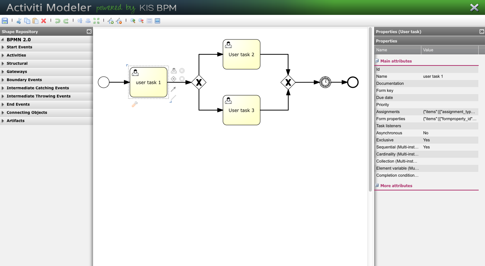
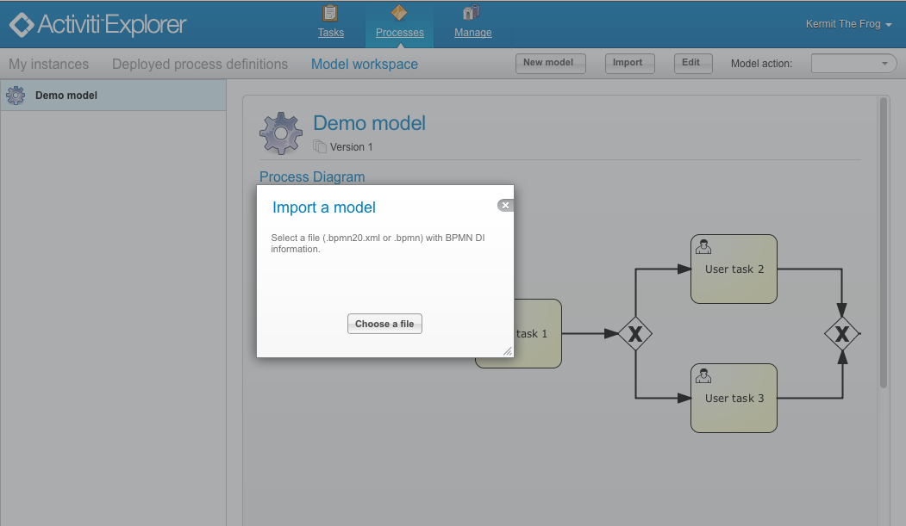
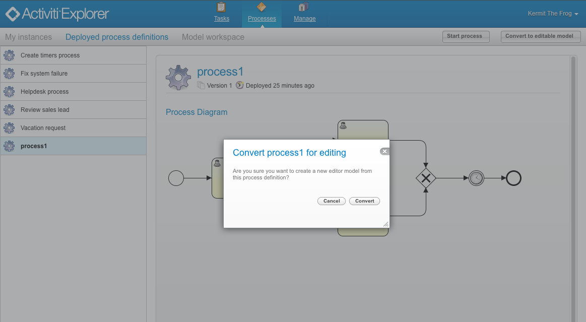
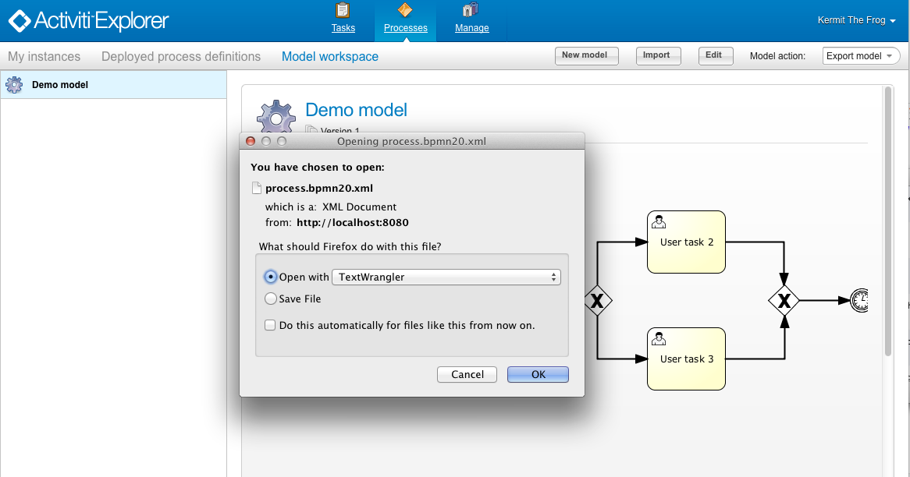
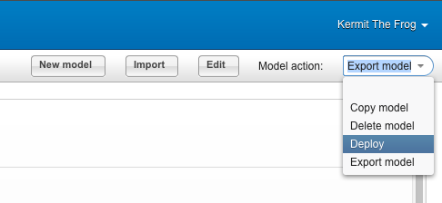

[[activitiModeler]]

== Activiti Modeler

Activiti Modeler is a BPMN web modeler component that's available as part of the <<activitiExplorer,Activiti Explorer>> web application. 
The Modeler is a fork of the link:$$http://code.google.com/p/signavio-core-components/$$[Signavio Core Components] project. 
The Activiti Modeler is an Angular JS based application since version 5.17.0 (before it was an Ext-JS based application). The Angular JS part of the Activiti Modeler is released with a LGPL license.
A main difference with the previous Activiti Modeler (Signavio Core Components) is that that the new modeler is maintained and developed as part of the Activiti project. 
The goal of the Activiti Modeler is to support all the BPMN elements and extension supported by the Activiti Engine.
 
When you run the Activiti Explorer with the default configuration one demo process will be available in the model workspace.

image::images/modeler.example.process.png[align="center"]
    

=== Model editing

When you click on the edit button in the model workspace the model will be opened in the modeler. On the left side of the screen the available palette of BPMN elements and Activiti extensions is available. You can drag and drop new elements on the canvas when needed. On the bottom side of the screen the attributes of a selected element can be filled-in. In the example screenshot a user task is selected and you can fill-in user task attributes like assignment, form properties and due date. 
To return to the Activiti Explorer you can click the close button at the top right of the screen.

=== Importing existing models

You can also import existing models into the model workspace to edit them in the Activiti Modeler. Click on the import button and select a .bpmn or .bpmn20.xml file. Note that the BPMN XML file should contain BPMN DI information.

      

=== Convert deployed definitions to a editable model

Deployed process definition can be converted into models that can be edited by the Activiti Modeler. Note that the process definition should contain BPMN DI information.

=== Export model to BPMN XML

A model in the model workspace can be exported to a BPMN XML file. Select the export option in the model action select box.
      
    

=== Deploy model to the Activiti Engine

When a model contains all the attributes necessary to be executed, it can be deployed to the Activiti Engine. Select the deploy option in the model action select box.

      
    

